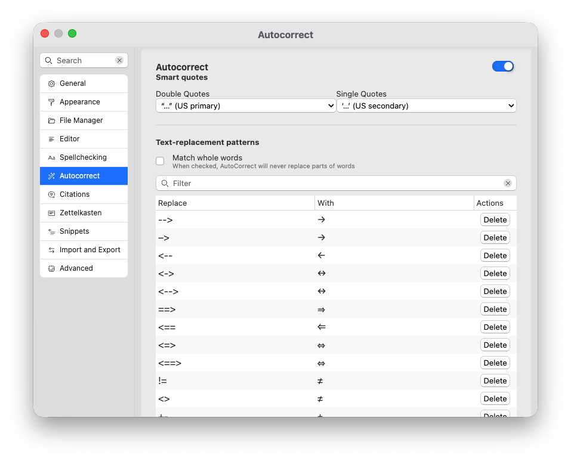

# Autocorreção e mágicas

A correção automática é uma ferramenta que permite corrigir erros comuns e expandir o texto conforme você digita. Pode ser usado, por exemplo, para inserir caracteres tipograficamente corretos ou expandir abreviações.

Magic Quotes é uma ferramenta que você pode inserir aspas tipograficamente corretas (“inteligentes”) na medida em que você digita, adequadas ao idioma.

Juntas, as duas ferramentas oferecem uma interface de baixo nível para garantir que o texto que você escreve seja preciso e tipograficamente correto.

Como ambas as ferramentas substituem caracteres específicos por outros caracteres, ambas as ferramentas podem ser definidas no mesmo local nas preferências → “Autocorreção”.

## Autocorreção

A correção automática é um serviço que pode substituir certas sequências de caracteres por outras. Você considerará isso pela maneira como os produtos Microsoft podem substituir, por exemplo, os caracteres `-->` por um símbolo de seta tipograficamente correto, `→`.

A correção automática é essencialmente uma tabela de substituições. O Zettlr verificará constantemente seu texto enquanto você escreve e, se detectar uma sequência na tabela de substituição, substituirá automaticamente a sequência pela substituição que você definiu.

Zettlr vem com uma variedade de substituições úteis predefinidas. Isso inclui conjuntos, operadores matemáticos e frações comuns.

**Dica:**

Ser capaz de substituir caracteres ASCII simples, como três pontos (`...`) pelo símbolo de reticências corretas (`…`) é útil especialmente no Windows, onde a inserção de símbolos tipográficos especiais geralmente requer um bloco numérico e códigos ALT.

A correção automática pode ser ajustada de acordo com suas necessidades. Primeiro, a correção automática *sempre* substituirá uma sequência de caracteres *apenas* se você digitar um espaço ou inserir uma nova linha. O objetivo disso é evitar a correção automática prejudicial em casos em que isso não seja prejudicial.

Para evitar a correção automática mesmo ao inserir um espaço, mantenha pressionada a tecla <kbd>Shift</kbd> enquanto insere um espaço.

Por último, por padrão, a Autocorreção também substituirá partes de palavras. Embora isso possa ser útil, a configuração “Corresponder palavras inteiras” nas opções garante que apenas palavras inteiras (=separadas por espaços) sejam retiradas.

**Observação:**

    A AutoCorreção funciona apenas em texto Markdown. Não se aplica em código ou comentários.

## Citações Mágicas

Magic Quotes é uma extensão que ajuda você a escrever aspas tipograficamente corretas, em vez do padrão (`"` e `'`). Zettlr inclui aspas tipograficamente corretas para muitos idiomas.

**Observação:**

As mensagens mágicas estão ativas apenas em texto Markdown. O recurso não se aplica a códigos ou comentários, pois aspas regulares são importantes.

Para entender as aspas, é útil definir três termos:

* **Aspas primárias** (geralmente aspas “duplas”) são as aspas regulares usadas em textos para citar frases. Eles são chamados de primários porque são o padrão.
* **Aspas secundárias** (geralmente aspas “simples”) são usadas principalmente para denotar restrições entre aspas. Por exemplo, se você citar uma obra que cita outra coisa, você desejaria usar aspas secundárias para denotar as aspas internas. Exemplo: `In another case, Author writes "that the 'common misperceptions' (Another Author) are too common to ignore."`
* **Aspas alternativas** são apenas isso: alternativas para as aspas comuns usadas. Em alguns idiomas, não existe um padrão definitivo para aspas e outros também são possíveis. Por exemplo, o alemão geralmente exige aspas “inferiores e superiores”. No entanto, alguns autores alemães preferem os “guillemots” franceses. Estas são, portanto, chamadas de aspas “alternativas”.

Nas opções → “Autocorreção” você pode selecionar quais aspas primárias e secundárias que deseja usar separadamente.

### Trocando interferências como escritor bilíngue

Muitos autores escrevem em pelo menos duas línguas diferentes. Para esses usuários, é complicado usar as preferências para trocar as aspas sempre que o idioma muda. Assim, o Zettlr oferece um controle para alternar rapidamente.

Para usá-lo, você precisa ativar a barra de status. A barra de status inclui um controle para Magic Quotes que mostra as aspas ativas no momento. Para trocá-los rapidamente, clique no controle e selecione seu idioma na lista.

**Observação:**

    A barra de status tem como objetivo alternar entre aspas rapidamente. Isso significa que você não pode alterar as aspas primárias e secundárias de forma independente.

### Transformando instruções mágicas em instruções regulares

Às vezes, é necessário usar aspas regulares (não tipográficas). Para transformar um aspa inteligente em aspa normal, coloque o cursor próximo à marca e pressione <kbd>Backspace</kbd>. Em vez de excluir as aspas, o Zettlra irá convertê-las em seu pingente não tipográfico. Somente quando você pressionar <kbd>Backspace</kbd> uma segunda vez ou o Zettlr excluirá as aspas.