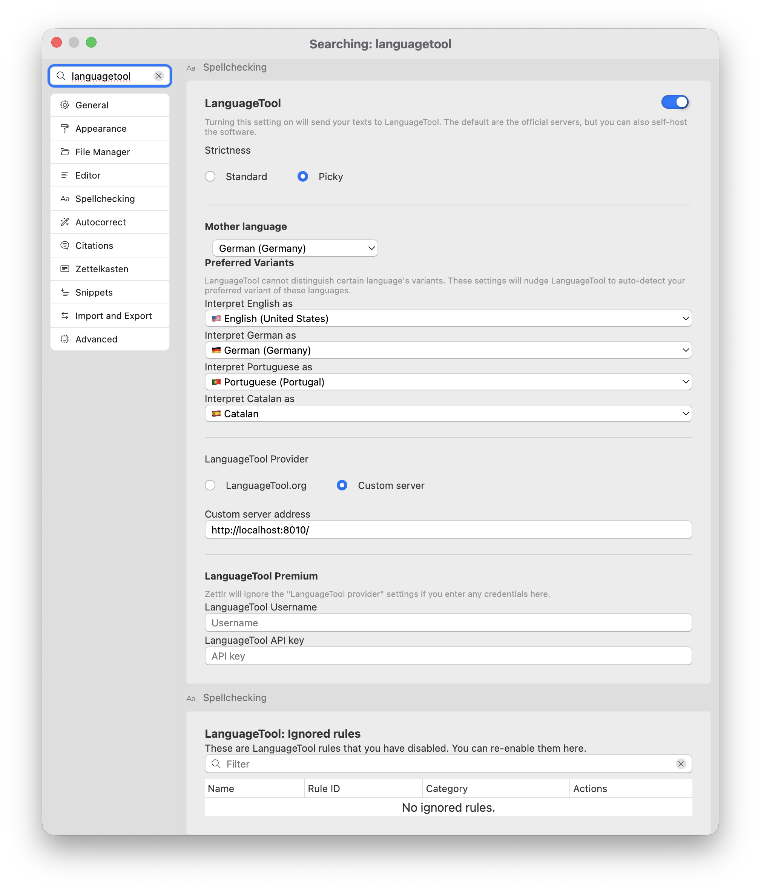
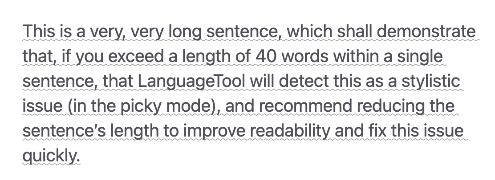
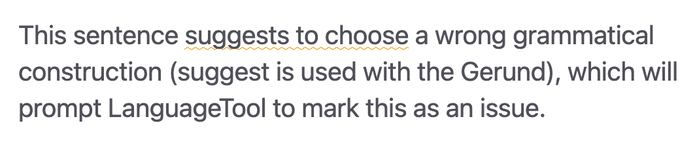
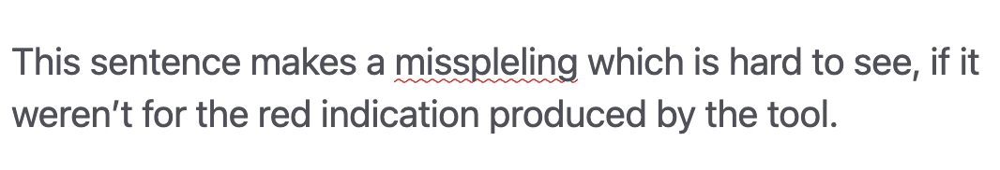
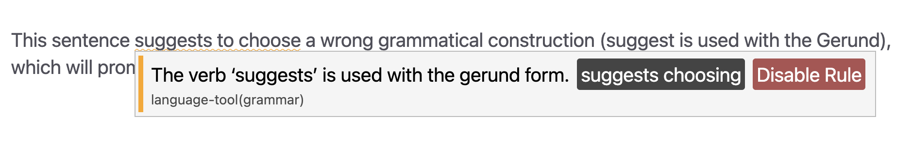

# Ferramenta de Idioma

Além de uma simples verificação ortográfica usando dicionários, o Zettlr também possui uma ferramenta mais abrangente que verifica erros ortográficos e gramaticais: LanguageTool.

## O que é o LanguageTool?

LanguageTool é um serviço semelhante ao Grammarly. No entanto, ao contrário do Grammarly, é possível configurar o LanguageTool localmente. O Zettlr integra-se a ele, já que a solução em si é oferecida como uma ferramenta Open Source.

**Aviso:**

Por padrão, o Zettlr usa os servidores oficiais do LanguageTool. Isso significa que seus textos serão transmitidos pela internet para o LanguageTool.org para verificação de problemas, ficando o uso sujeito à [política de privacidade do LanguageTool](https://languagetool.org/legal/privacy). Para evitar isso, você precisará configurar o LanguageTool no seu computador. [Descrevemos como fazer isso em nosso guia](../guides/languagetool-local.md).

Outro benefício de instalar o LanguageTool localmente é que ele também funcionará offline, em trens ou aviões.

## Ativando o LanguageTool

O LanguageTool está desabilitado por padrão, pois requer uma conexão com a Internet para o serviço. Depois de ativar a opção correspondente nas configurações, o LanguageTool verificará se há problemas em seus documentos.

Para ativar o LanguageTool, vá para a seção “Verificação ortográfica” das preferências.

A seção oferece uma variedade de opções para configurar o LanguageTool, muitas das quais você já deve conhecer a extensão do navegador LanguageTool, se você usar.

O LanguageTool pode ser ativado com o botão grande à direita do título da seção.

A seguir, você pode determinar o rigor da verificação. A escolha de “Exigente” permite algumas regras adicionais, principalmente estilísticas, que podem permitir uma verificação mais completa.

Na próxima seção, você poderá fazer várias configurações de idioma.

Primeiro, você pode selecionar seu idioma nativo, o que permite ao LanguageTool verificar problemas que ocorrem apenas quando falantes de um determinado idioma escrevem em outro idioma. O caso mais proeminente disso são os “falsos amigos”. Por exemplo, um falante de alemão pode confundir a palavra sueca “öl” para “cerveja” com a palavra alemã “Öl” para “óleo”.

Em seguida, você pode selecionar suas variantes preferidas, o que é útil para idiomas com vários dialetos que podem ser difíceis de distinguir. O LanguageTool usa essas informações para identificar corretamente, por exemplo, seu inglês como britânico ou americano.

A terceira seção permite que você escolha entre os servidores oficiais do LanguageTool ou seu próprio servidor personalizado.

**Dica:**

Recomendamos fortemente a configuração do LanguageTool localmente. Fornecemos um [guia extenso](../guides/languagetool-local.md) para isso.

A última seção da configuração principal do LanguageTool permite que você insira seu nome de usuário e chave API do LanguageTool, se você atualizar o LanguageTool Premium.

**Aviso:**

    Deixe esses campos vazios se você executar o LanguageTool localmente. Assim que você inserir qualquer texto em qualquer um desses dois campos, o Zettlr mudará automaticamente para os servidores do LanguageTool Premium, porque não consegue distinguir letras consultadas de uma combinação válida de nome de usuário/tecla.

A outra seção do LanguageTool em “Regras ignoradas” lista qualquer regra que você desativou no LanguageTool. Remova a regra desta lista para reativá-la.

## Usando o LanguageTool e recursos

Uma vez configurado, o Zettlr envia seu texto para o LanguageTool – localmente ou para seus servidores oficiais – e permite que a ferramenta os verifique.

O LanguageTool verifica uma ampla gama de diferentes regras, normas, sugestões e escolhas estilísticas. Dentro do Zettlr, eles são classificados em três grupos:

* Uma linha **cinza** abaixo de uma palavra ou extensão de texto indica um problema principalmente estilístico que não está errado, mas pode melhorar a legibilidade ou o tom do seu texto se for corrigido.
* Uma linha **amarela** abaixo de uma palavra ou trecho de texto indica um possível problema ao qual você deve prestar atenção para melhorar seu texto.
* Uma linha **vermelha** sob uma palavra ou extensão indica quase certamente um erro.

Um exemplo de problema “cinza” ou menor seria se uma frase se torna muito longa. O LanguageTool sugerirá reduzir seu comprimento e indicará isso sublinhando-o em cinza.

Um exemplo de aviso “amarelo” seria uma potencial duplicação de palavras ou uso incorreto de construções gramaticais. Às vezes, isso é surpreendente, mas o LanguageTool destaca isso para você.

Finalmente, um exemplo de erro “vermelho” seria um erro ortográfico clássico ou se algo estivesse definitivamente incorreto em seu texto.

Sempre que o LanguageTool marcar um problema, mova o mouse sobre o trecho de texto afetado. Isso mostrará uma tip explicando o problema. Muitas vezes, o LanguageTool é capaz de produzir uma correção que você pode aplicar clicando na ação correspondente. No exemplo abaixo, clique em “sugere escolha” substituiria automaticamente a frase afetada “sugere escolher” pela opção “sugere escolha”.

Às vezes, você pode ter uma opinião diferente sobre certas regras. Neste caso, você pode desabilitar a regra com o botão vermelho. Se mudar de ideia ou alterar acidentalmente uma regra, você poderá remover a lista de regras desativadas nas preferências.

## LanguageTool na barra de status

Se a barra de status estiver ativada, um controle será exibido para indicar o status do LanguageTool.

O controle pode ter três estados diferentes:

1. Enquanto o LanguageTool processa seu texto, o controle mostra uma ampulheta, indicando que está ocupado verificando seu texto.
2. Enquanto o LanguageTool estiver ocioso, ele mostrará uma marca de seleção, indicando que o linting foi concluído. Ele também mostra um ícone de bandeira baixa qual idioma ele verifica.
2. Se ocorrer um erro, o controle irá exibi-lo.

Você também pode clicar no controle para visualizar uma lista de todos os idiomas suportados pela ferramenta. Por padrão, a ferramenta detectará automaticamente o idioma, mas você pode substituí-lo aqui.

**Dica:**

    A lista de idiomas disponíveis é fornecida pelo próprio servidor. Dependendo da versão do LanguageTool que você usa ou do serviço Premium, esta lista pode ser diferente.

Todas as sugestões produzidas pelo LanguageTool são coletadas no painel de diagnóstico. Você pode ver uma contagem de todos os diversos problemas no controle de diagnóstico, que também pode abrir o painel.