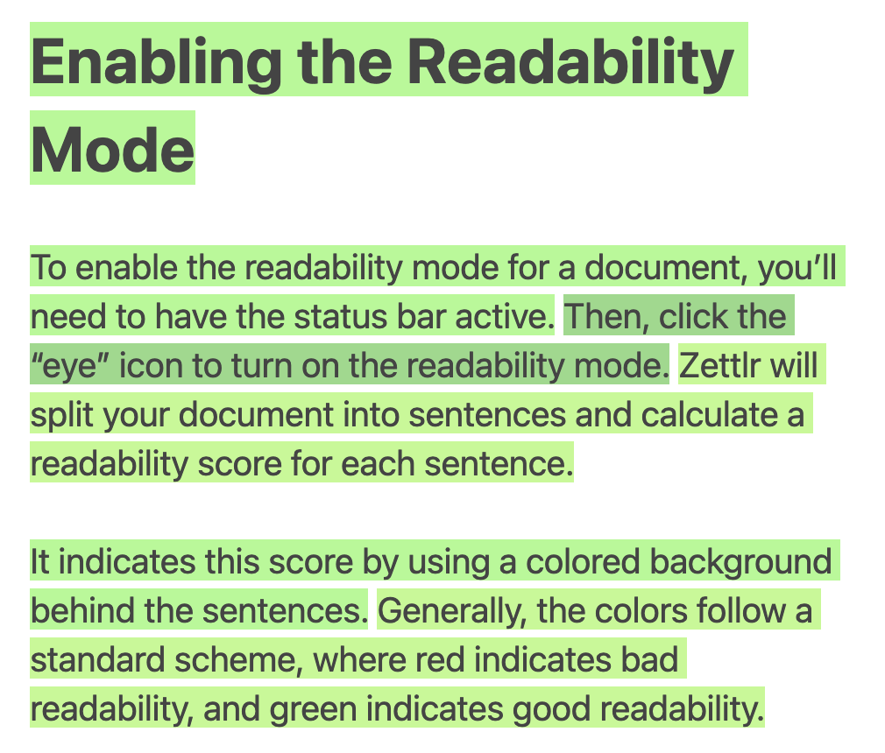

# Legibilidade

Outra ferramenta que o Zettlr integra é determinar a “legibilidade” dos seus textos. Ele calcula uma pontuação de “legibilidade” e atribui um cor de fundo para suas frases com base nessa pontuação.

Legibilidade é um termo científico que se originou em meados do século 20 para um conjunto de regras que foram determinadas para melhorar a facilidade com que as pessoas podem compreender um texto. Zettlr incorpora quatro algoritmos configurados para calcular e visualizar a legibilidade de seus textos.

**Observação:**

    Como a maior parte dos trabalhos sobre legibilidade vem de pesquisadores educacionais norte-americanos, o modo funciona melhor com textos em inglês. Como esses algoritmos costumam usar contagens de palavras e sílabas, eles também generalizam para outras línguas, mas desabilitam uma escrita latina.

## Habilitando o modo de legibilidade

Para ativar o modo de legibilidade de um documento, você precisa ter uma barra de status ativo. Em seguida, clique no ícone “olho” para ativar o modo de legibilidade. O Zettlr dividirá seu documento em frases e calculará uma pontuação de legibilidade para cada frase.

indica essa pontuação usando um fundo colorido atrás das frases. Geralmente, as cores seguem um esquema padrão, onde vermelho indica má legibilidade e verde indica boa legibilidade.

## Algoritmos Disponíveis

Não existe uma métrica única para legibilidade. Nas opções (seção “Editor”), você pode selecionar um dos quatro algoritmos disponíveis para calcular a possibilidade de legibilidade:

* [fórmula de legibilidade Dale-Chall](https://en.wikipedia.org/wiki/Dale%E2%80%93Chall_readability_formula)
* [Índice de Gunning-Fog](https://en.wikipedia.org/wiki/Gunning_fog_index)
* [índice Coleman-Liau](https://en.wikipedia.org/wiki/Coleman%E2%80%93Liau_index)
* [Índice de legibilidade automatizado](http://www.readabilityformulas.com/automated-readability-index.php)

Estes comentários não são considerados uma escrita “difícil” e na “aspereza” das orientações que fornecemos. Nem todos os índices são uma boa escolha para todos os textos. Abaixo, apresentamos todos os quatro algoritmos e fornecemos algumas orientações.

### Fórmula de legibilidade Dale-Chall

A fórmula Dale-Chall foi criada nos primórdios da pesquisa educacional e foi de autoria de Edgar Dale e Jeanne Chall. Seu objetivo era fornecer uma medida mensurável para determinar a legibilidade de textos para crianças em idade escolar. Ele usa uma lista de 3.000 palavras que são simples de entender para alunos americanos da quarta série e dá uma pontuação que varia aproximadamente de 0 a 10, o que se traduz aproximadamente nos anos de escolaridade necessários para compreender um texto. Isso significa: se uma frase receber nota 10, você precisará de um diploma universitário para entender o texto, enquanto uma frase com nota 1 pode ser entendida por iniciantes.

**Dica:**

    Use Dale-Chall se você estiver escrevendo textos para um público mais amplo, pois o algoritmo dará crédito ao seu texto por frases curtas e concisas, sem forçá-lo a usar frases ridiculamente curtas.

### Índice Gunning-Fog

Gunning-Fog foi criado nos primórdios dos tablóides e de fácil leitura. Em 1952, Robert Gunning procurava uma maneira de tornar mensuráveis ​​os livros e jornais que publicava. O índice Gunning-Fog retorna uma pontuação que se correlaciona aproximadamente com os anos de educação formal necessários para que um leitor compreenda um texto. Ainda assim, sendo um empresário e portanto interessado numa elevada dispersão de suas publicações, o algoritmo de Gunning tende a dar resultados elevados mesmo a textos relativamente simples de compreender. Se você percorrer diferentes algoritmos, notará que o Gunning-Fog tende a pontuar tudo pior do que outros algoritmos.

**Dica:**

    Use Gunning-Fog se quiser escrever textos publicitários curtos (por exemplo, para sites) que não podem contar com uma aplicação intrínseca nem básica para ler.

### Índice Coleman/Liau

Com a queda dos preços dos computadores, as estatísticas auxiliadas por computador tornaram-se uma opção popular para processar grandes quantidades de dados e produzir dados mensuráveis ​​​​​​significativos. O índice Coleman/Liau é dessa época e é um algoritmo que não depende de contagens de sílabas ou listas com “palavras difíceis”. Portanto, o índice Coleman/Liau é extremamente preciso em sua implementação no Zettlr. Tal como acontece com os outros, dá uma pontuação que se aproxima dos anos de educação formal necessários para compreender uma frase. Além disso, Coleman/Liau dá resultados razoáveis ​​e não penaliza muito sentenças um pouco mais longas.

**Dica:**

    Use Coleman/Liau se precisar de uma medição precisa da legibilidade de qualquer texto. Não combina bem com frases de uma palavra, mas traz resultados positivos para textos mais difíceis de entender.

### Índice de legibilidade automática (ARI)

O Índice de Legibilidade Automatizado está alinhado com Coleman/Liau, pois é uma fórmula mais recente para cálculo de legibilidade com base em análise estatística simples. É o mais “clemente” dos algoritmos e produz resultados razoáveis.

**Dica:**

    Use o ARI se você estiver escrevendo textos mais exigentes, como trabalhos acadêmicos, pois ele dará os melhores resultados mesmo para algumas frases difíceis.

## Uma nota sobre “palavras difíceis”

Em sua própria implementação, o Zettlr não vem com uma lista de palavras simples de compreender que o Dale-Chall exige. Em vez disso, ele usa uma abordagem diferente. Uma lista de palavras simples de entender diferentes tempos em tempos e, obviamente, de idioma para idioma. Portanto, o Zettlr leva em consideração outro mensurável para determinar palavras consideradas graves: a variação do idioma.

Palavras difíceis para Zettlr são definidas como sendo maiores que duas vezes o desvio padrão do comprimento médio da palavra. Como Coleman e Liau colocaram em seu artigo de 1975 _A Computer Readability Formula Designed for Machine Scoring_, o comprimento das palavras é um indicador muito melhor da dificuldade das palavras do que o número de sílabas. Portanto, os algoritmos podem pontuar sentenças em qualquer linguagem de escrita ocidental, não apenas em inglês. Você pode consultar a explicação do algoritmo [em nossa página de recursos de legibilidade](https://zettlr.com/readability).

Além disso, o Zettlr faz mais uma alteração nos algoritmos: embora todos os quatro algoritmos tenham sido concebidos para serem aplicados a textos completos, o modo de legibilidade pegará cada frase, uma de cada vez, e, portanto, deixará de fora do seu contexto. Em geral, isto se aproxima da dificuldade da frase, mas obviamente pode marcar algumas frases como verdes que são difíceis de compreender no seu contexto dado, enquanto marcará algumas frases a vermelho que ainda se enquadram no contexto dado.