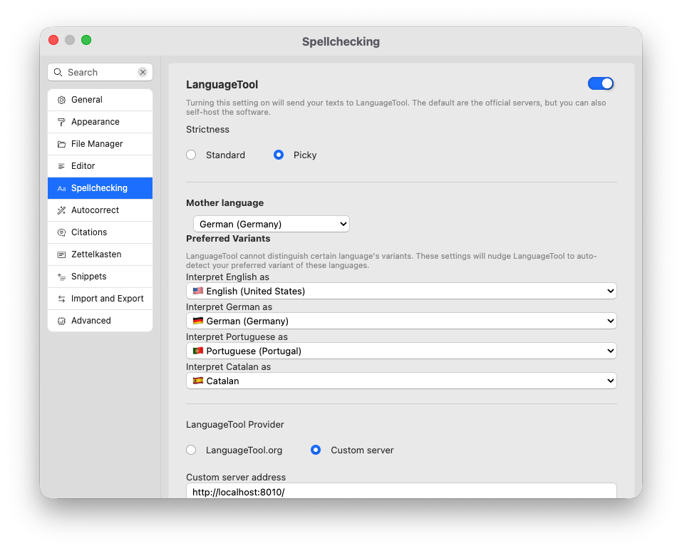

# Correção ortográfica

A verificação ortográfica é uma ferramenta tradicional disponível em quase todos os aplicativos voltados para escrita. A maneira mais fácil de verificar a exatidão de seus textos é usar dicionários. Zettlr suporta o padrão comum [Hunspell](https://en.wikipedia.org/wiki/Hunspell).

## Ativar seleção ortográfica

Para ativar a seleção ortográfica, abra as opções e navegue até a seção “Verificação ortográfica”.



Esta seção fornece duas configurações centrais para verificação ortográfica. Primeiro, permite selecionar um ou mais dicionários de uma tabela. Em segundo lugar, permite gerenciar seu dicionário do usuário.

Você pode ativar vários dicionários para escrever normalmente em vários idiomas.

**Dica:**

  O Zettlr verificará cada palavra em todos os dicionários ativos. Somente quando nenhum dicionário informar que uma palavra está correta ou Zettlr marcará como um erro ortográfico.

Por padrão, o Zettlr vem com vários dicionários comuns:

* Alemão (Alemanha)
* Inglês (Reino Unido)
* Inglês (EUA)
* Espanhol (Espanha)
*Francês
* Holandês
*Rússia
* Turco
* Ucraniano

Você pode instalar dicionários adicionais. Consulte a seção correspondente mais abaixo para saber como instalar dicionários adicionais.

Você pode filtrar a lista de dicionários disponíveis escrevendo uma chave de pesquisa no campo de texto superior.

Assim que você ativar um dicionário com a caixa de seleção em sua linha, o Zettlr carregará o dicionário e obterá uma comparação de seus textos com ele.

**Observação:**

  Carregar um dicionário pode demorar um pouco. Especialmente os maiores podem fazer com que o aplicativo pare de responder por um breve período.

## Desative a seleção ortográfica

Para desabilitar a seleção ortográfica, basta desabilitar todos os dicionários através de suas caixas de seleção. Se nenhum dicionário estiver ativado, o Zettlr não tentará a verificação ortográfica ao realizar seus textos.

## Dicionário personalizado

Você também pode adicionar palavras ao seu próprio dicionário personalizado. Para adicionar uma palavra ao seu dicionário, clique com o botão direito na palavra marcada e selecione “Adicionar ao dicionário”.

Para remover palavras do seu dicionário personalizado, acesse conforme desejar e a seção “Verificação ortográfica”. Aqui você pode remover palavras do seu dicionário do usuário.

## Adicionando novos dicionários

Para adicionar dicionários adicionais, você precisará procurar dicionários compatíveis com Hunspell. Em essência, tal dicionário consiste em uma pasta contendo dois arquivos – um arquivo `.dic` e um arquivo `.aff`. O arquivo `.dic` contém todas as palavras de um idioma com os chamados afixos, por exemplo, características da palavra. O arquivo `.aff` contém as definições desses sinalizadores.

Um exemplo de estrutura de pastas para o dicionário italiano seria:

```
it-IT /
  it-IT.dic
  it-IT.aff
```

Um bom ponto de partida para encontrar dicionários adequados é [este repositório do usuário GitHub wooorm](https://github.com/wooorm/dictionaries). Basta baixar uma das pastas para o seu computador. Em seguida, no Zettlr, clique em “Arquivo” → “Importar Dicionário….” Isso abrirá o navegador de arquivos do seu computador com a pasta `dict` no Zettlr aberto. Copie toda a pasta do dicionário que você acabou de baixar para a pasta `dict`. Então você pode selecionar este dicionário nas configurações.

Tenha em mente que o Zettlr realizará alguns testes básicos para determinar se um dicionário é válido. Para que o Zettlr exiba o dicionário e possa selecioná-lo, o dicionário deve seguir as seguintes regras:

1. A pasta que contém os arquivos `.dic` e `.aff` deve ser nomeada usando a [tag BCP-47](https://tools.ietf.org/html/bcp47) correspondente ao idioma que o dicionário contém. Embora você possa não estar ciente do termo “BCP-47”, é uma etiqueta de idioma muito comum. O dicionário alemão seria denominado `de-DE` (para “alemão alemão”) ou `de-CH` (para alemão suíço), ou simplesmente `it` (para italiano).
2. Dentro desta pasta devem estar presentes pelo menos dois arquivos: um arquivo `.dic` e um arquivo `.aff`. Eles devem ser nomeados usando a tag BCP-47 da pasta ou `index.dic`/`index.aff`.
3. A pasta do dicionário pode conter outros arquivos (como uma lista de autores ou uma LICENÇA). Estes serão ignorados.

Resumindo, o Zettlr garantirá que um dicionário seja válido, verificando se existem os seguintes caminhos:

- `bcp-47/bcp-47.dic` e `bcp-47/bcp-47.aff` _ou_
- `bcp-47/index.dic` e `bcp-47/index.aff`