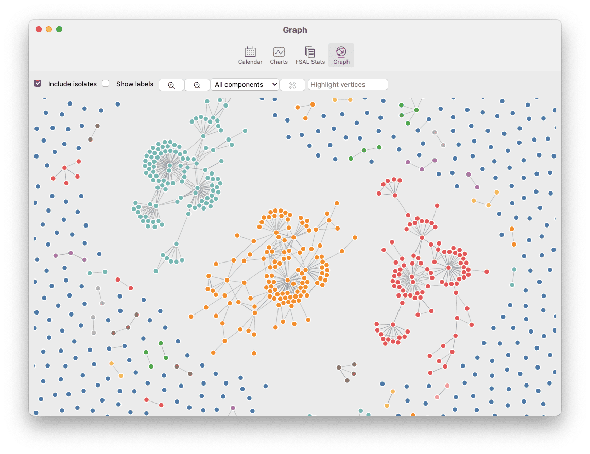
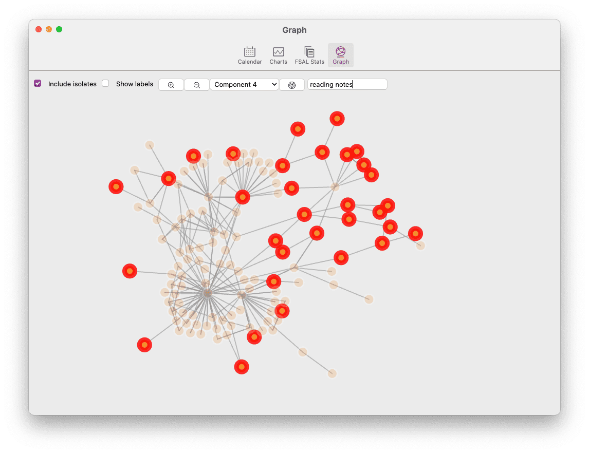

# Visualização de gráficos

Como outros aplicativos, o Zettlr apresenta uma visualização gráfica que permite visualizar a rede que você criou interligando seus arquivos. Isso pode ajudá-lo a identificar clusters à medida que eles surgem, encontrar maneiras de conectar componentes separados e obter uma visão geral de todos os seus arquivos.

**Observação:**

Gráficos e redes são tipos diferentes de feras. Eles podem ser muito poderosos, mas também podem atuar como um teste de Rorschach, onde você identifica padrões que não existem. Para uma introdução geral, recomendamos vivamente que leia [Qual é o ponto de vista de um gráfico?](https://www.arthurperret.fr/blog/2022-02-13-what-is-the-point-of-a-graph-view.html) de Arthur Perret, bem como - para uma noção mais cautelosa - o artigo [Quo Vadis, PKM?](https://www.hendrik-erz.de/post/quo-vadis-pkm) de Hendrik Erz.

## O que é um gráfico?

Primeiro, vamos começar com um curso intensivo em ciência de redes. Uma visualização gráfica de um banco de dados de um sistema de gerenciamento de conhecimento pessoal (PKMS) é apenas vagamente relacionada a redes empíricas, como redes sociais, mas mesmo assim pode ajudar.

Um gráfico é matematicamente definido como um conjunto de **vértices** (ou nós), que são conectados por um conjunto de **arestas** (ou links). As arestas são chamadas de **arcos** quando são direcionadas. Os vértices podem ser conectados a um único outro vértice (uma díade), a dois outros vértices (uma tríade) ou a mais do que isso. Os vértices também podem ser isolados, ou seja, desconectados. Um cluster de vértices conectado dentro de uma rede é chamado de **componente**. Além disso, um gráfico pode ser **direcionado** (ou seja, os arcos entre dois vértices têm uma direção, ou seja, o arco de A para B não é o mesmo que o arco de B para A) ou **não direcionado** (o que significa que a aresta de A para B também implica a aresta de B para A). Um gráfico também pode ser **ponderado**, caso suas arestas tenham algum número associado a elas. Finalmente, um gráfico pode ser simples ou **multiplex**. Um multiplex gráfico não possui apenas um tipo de aresta, mas vários.

Se tudo isso agora parece muito abstrato, vamos dar exemplos às definições:

* Cada **arquivo** carregado no Zettlr é um **vértice**
* Cada **link** entre dois arquivos é representado como um **arco** (= aresta intencionalmente) do arquivo A para o arquivo B
* Um **backlink** também cria o **arco** oposto de B para A
* Um **peso** de link pode ser uma quantidade de vezes que o arquivo A é vinculado ao arquivo B (se você vincular várias partes do seu arquivo, por exemplo)
* Um gráfico **multiplex** implicaria que os arquivos não só podem ser conectados por links, mas também por, por exemplo, palavras-chave compartilhadas ou algum outro recurso

Há muito mais nas redes, mas por enquanto vamos deixar por isso mesmo. Sinta-se à vontade para ler mais online se estiver interessado!

## Implementação dos gráficos do Zettlr

Zettlr agora implementa um subconjunto de recursos disponíveis para criar um gráfico. Especificamente, a partir de agora será…

*…crie um vértice por arquivo carregado no Zettlr
*…crie uma borda por link de um arquivo para outro
* … trate todos os links como *não direcionados* e *não ponderados*

Nos bastidores, o Zettlr usa a biblioteca D3 para facilitar a renderização real dos gráficos. Utilizamos um layout direcionado à força (no entanto, não Fruchterman-Reingold, para aqueles que têm alguma experiência com visualizações de rede) que tenta colocar os diferentes nós de uma forma que eles não se sobreponham e que você possa ver clusters.

**Aviso:**

    A localização real dos vértices, bem como a distância para outros vértices **não tem nenhum significado causador**!! É muito importante lembrar disso: apenas as arestas entre os vários vértices têm significado, não suas posições ou distâncias!

## Abrindo a visualização do gráfico

A visualização do gráfico não está disponível atualmente por meio de um botão colocado em destaque. Você pode acessar a visualização dos gráficos abrindo uma janela de informações descobertas na barra de ferramentas e navegando com o botão "mais estatísticas..." até uma janela separada mostrada na imagem abaixo.

## Interagindo com a visualização do gráfico

A interação com esta rede é possível de várias maneiras. Passar o mouse sobre um vértice na rede mostrará uma tip de ferramenta que informa o nome do arquivo e a qual componente ele pertence. Clique em um nó para abri-lo em seu editor principal. Dessa forma, você pode manter a visualização dos gráficos abertos na lateral da janela principal e navegar em seus arquivos nesse formato.

Além disso, existem alguns controles disponíveis para personalizar a exibição dos gráficos.

A primeira caixa de seleção determina se **isolados** serão selecionados. Principalmente se você estiver interessado em clusters específicos de nós (componentes), seria aconselhável excluir esses isolados, pois isso torna a visualização muito mais limpa.

A segunda caixa de seleção permite exibir permanentemente os rótulos próximos aos vértices. No entanto, especialmente em redes densas, isso pode ser caótico e, portanto, está desativado por padrão.

Os dois botões de zoom permitem aumentar e diminuir o zoom dos gráficos para obter uma perspectiva panorâmica de sua rede ou focar em uma parte específica da rede.

À medida que você vincula mais e mais arquivos, pode fazer sentido observar apenas um componente específico que foi formado. O menu suspenso próximo aos botões de zoom permite filtrar componentes específicos. O número do componente em si não é significativo (o algoritmo de detecção de comunidade abaixo apenas lista os componentes na ordem de detecção), mas a lista é definida pelo **tamanho** do componente. Os componentes maiores ficarão no topo do menu suspenso, enquanto os componentes menores (ou seja, as díades) não serão finais.

Após o menu suspenso, você notará um botão "alvo". Este botão centraliza a visualização dos gráficos de volta à origem.

O último elemento é um campo de texto que permite filtrar o vértice. O texto digitado aqui será comparado com os caminhos absolutos dos arquivos individuais, com aqueles que não foram esmaecidos e aqueles que foram destacados. Além disso, o gráfico moverá automaticamente uma janela de visualização para as orientações centrais dos elementos correspondentes.