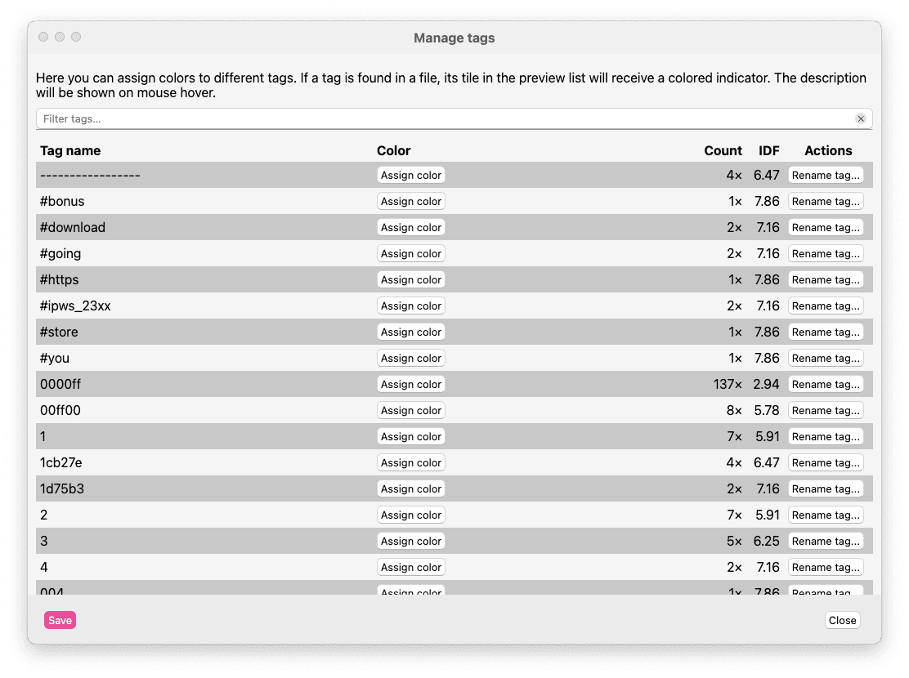

# Gerenciador de tags

Zettlr apresenta um sistema de marcação abrangente para adicionar palavras-chave aos seus arquivos para um sistema de classificação de arquivos horizontal e não hierárquico. No entanto, à medida que a quantidade de arquivos em sua configuração aumenta, pode se tornar difícil manter uma visão geral das tags. Além disso, você pode querer usar algumas tags de uma forma mais funcional, como `#todo` ou `#needs-review`.

É por isso que o Zettlr contém um poderoso gerenciador de tags que permite gerenciar as tags em sua configuração. Você pode abrir o gerenciador de tags selecionando “Arquivo” → “Preferências” → “Gerenciador de tags” (macOS: “Zettlr” → “Gerenciador de tags”).

O gerenciador de tags lista todas as tags que o aplicativo encontrou em seus arquivos junto com uma contagem e uma pontuação de [Frequência inversa de documentos (IDF)](https://en.wikipedia.org/wiki/Tf%E2%80%93idf#Inverse_document_frequency). A pontuação IDF é inversamente proporcional à quantidade de arquivos em que uma tag ocorre e oferece uma pontuação informativa sobre a importância de uma tag. Quanto menor o número, menos relevante será a palavra-chave para diferenciar os arquivos uns dos outros. Normalmente, as tags funcionais terão uma pontuação IDF muito pequena, enquanto as tags raramente usadas terão uma pontuação alta.

## Classificação e filtragem de tags

Você tem várias opções para visualizar suas tags. Primeiro, você pode filtrar as tags com o campo de entrada no topo da lista. Isso pode ajudá-lo a encontrar as tags com mais rapidez.

A tabela pode ser definida clicando nos títulos das colunas. Por exemplo, clicando no rótulo da coluna “Contagem”, o Zettlr alternará entre listar arquivos com contagens crescentes e decrescentes.

## Atribuindo núcleos às tags

No meio do gerenciador de tags, você encontrará uma coluna “Cor”. Você pode usar isso para denotar tags “especiais” (às vezes chamadas de tags “funcionais”) que darão aos arquivos que contêm essa tag uma cor especial em locais específicos, como a lista de arquivos.

Por exemplo, você pode querer incluir uma tag “fazer” ou uma tag “precisa de revisão”. Para fazer isso, siga estas etapas:

1. Atribua uma tag a pelo menos um arquivo para que ela seja aplicável no gerenciador de tags.
2. Em seguida, abra o gerenciador de tags e obtenha a tag à qual deseja receber uma cor.
3. Clique em “Atribuir cor” para escolher uma cor.
4. Opcionalmente, escreva uma breve descrição no campo correspondente que será exibido quando você passar o mouse sobre um indicador colorido, por exemplo, na lista de arquivos.

Para remover a associação de núcleos de uma tag, basta clicar em “Remover cor”.

Ao finalizar, clique em “Salvar” para fechar o gerenciador de tags e aplicar as alterações.

## Renomeando tags

Por último, o gerenciador de tags permite renomear tags em massa. Por exemplo, se você usa uma determinada tag com frequência, mas decidiu que ela deveria ter um nome diferente, clique em “Renomear tag”. Escreva uma nova tag no campo de texto e confirme clicando em “Renomear”.

Em seguida, o Zettlr determinará primeiro quantos arquivos serão afetados e fornecerá uma janela de confirmação final questionando se você realmente deseja substituir a tag fornecida em todos os arquivos afetados. Clique em “Cancelar” para abortar o processo.

Após clicar em “Sim”, o Zettlr substituirá imediatamente as tags em todos os arquivos afetados.