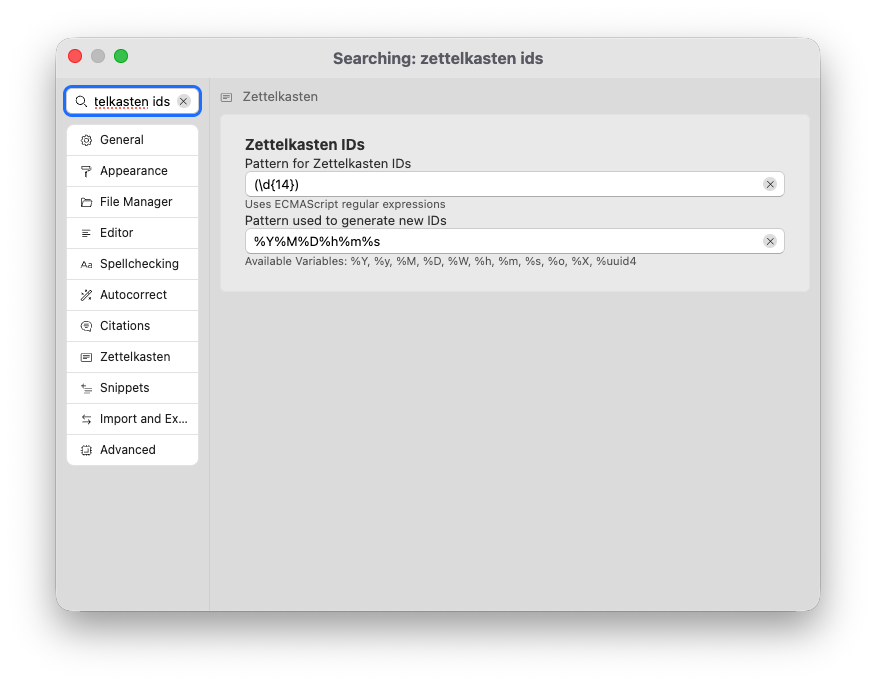
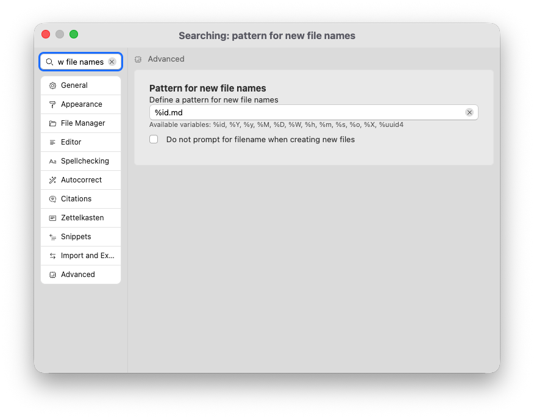
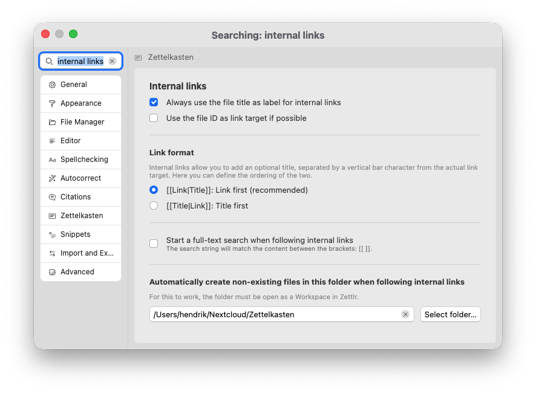

# O método Zettelkasten

A ideia de escrever Zettlr me veio à mente há vários anos, quando estávamos tentando elaborar bons fluxos de trabalho para redação acadêmica. Testamos muitos estilos e ideias de fluxo de trabalho diferentes, e um que escolhemos foi o método Zettelkasten. O problema naquela época era que a maior parte do software não conseguia implementá-lo. Mas hoje em dia existem cada vez mais aplicações que suportam algumas variações deste método.

Originalmente, o método vem do sociólogo alemão Niklas Luhmann, que, em um esforço para lembrar tudo o que leu ou pensou, projetou seu próprio Zettelkasten (na época simultânea) contendo cartões com algumas informações e números. Os números poderiam ser usados ​​para localizar outros cartões com outras informações que tenham alguma forma relacionada ao conteúdo do cartão. Esta foi uma forma de Luhmann fazer referências entre um conjunto de cartas e, à medida que a caixa foi enchendo com mais e mais cartas, permitiu que ela de alguma forma ganhasse “vida”, mostrando-lhe conexões entre certos conceitos que ele próprio não havia pensado.

A ideia básica, portanto, é permitir que você crie relacionamentos entre pequenas notas (ou, nesse caso, também arquivos longos) que lhe permitam não apenas avançar e voltar entre os arquivos, mas também identificar relacionamentos que emergem em seus arquivos.

## Gerencie um Zettelkasten com Zettlr

Três funções disponíveis no Zettlr para iniciar seu Zettelkasten:

1. Gerando IDs para arquivos
2. Vinculando pesquisas e arquivos
3. Marcando arquivos

## IDs do arquivo

Para criar links entre arquivos, considere primeiro se deve usar IDs ou nomes de arquivos. Você pode criar links no Zettlr entre arquivos usando qualquer um deles.

A vantagem dos nomes de arquivos é que eles são autoexplicativos. A desvantagem é que você não pode alterar o título do arquivo se o conteúdo da nota for diferente do que você planejou quando criou o arquivo.

É por isso que os IDs podem ser um bom remédio. Ao nomear arquivos usando apenas IDs numéricos, você separa o ID do arquivo de seu conteúdo — o título da nota pode mudar, mas o ID permanece o mesmo.

Por padrão, o Zettlr usa o carimbo de data/hora atual para IDs, no formato `YYYYMMDDHHMMSS`. Você pode adaptar este formato nas preferências → “Zettelkasten” → “Zettelkasten IDs”. Aqui, você tem duas opções: primeiro, você pode determinar como o Zettlr irá gerar novos IDs e, em segundo lugar, você precisará informar ao Zettlr como detectar tais IDs.

Este padrão de ID será usado para novos nomes de arquivos, embora você possa adaptá-lo nas preferências. Usando a configuração “Avançado” → “Padrão para novos nomes de arquivo” você pode alterar o nome de arquivo sugerido padrão para novos arquivos. Por padrão, ele gera um ID Zettelkasten, mas você tem outras opções.

Se você gosta de dar nomes descritivos aos seus arquivos, mas ainda deseja adicionar IDs a eles, demonstre-se de que seu arquivo esteja em foco e pressione <kbd>Cmd/Ctrl</kbd>+<kbd>L</kbd> para gerar um novo ID e insira-o na posição do cursor.

**Dica:**

Zettlr reconhece IDs (usando o padrão de ID nas preferências) tanto no nome do arquivo quanto no conteúdo do arquivo. O primeiro ID encontrado terá precedência. Você também pode gerar IDs ao usar snippets usando a variável `$ZKN_ID`.

## Vinculando arquivos

Com a questão da identificação do arquivo respondido, a próxima questão é como conectar os arquivos. Zettlr suporta dois tipos de links: **links implícitos** baseados em palavras-chave compartilhadas e **links explícitos** através de links wiki (ou links Zettelkasten, ou links internos).

### Vinculando arquivos implicitamente por meio de palavras-chave

Ao escrever suas anotações, adicione palavras-chave aos seus arquivos para classificá-los usando essas tags. Você pode adicionar palavras-chave de duas maneiras.

Primeiro, você pode adicionar uma tag usando o formato comum de hashtag no estilo do Twitter. Um caractere `#` seguido por letras, números e alguns outros caracteres será interpretado como uma tag. Zettlr fornece destaque de sintaxe para indicar o que determinará ser uma tag. Você pode manter os botões <kbd>Cmd/Ctrl</kbd> enquanto clica em uma tag para iniciar uma busca por outros arquivos que tenham essa tag.

Em segundo lugar, você pode adicionar suas tags ou palavras-chave a um arquivo usando um tema YAML. Isso tem vantagens e vantagens em comparação com hashtags simples no estilo do Twitter. Os benefícios incluem que essas palavras-chave não aparecerão diretamente no conteúdo da nota, mas ainda serão associadas ao arquivo. Além disso, você pode usar espaços nessas palavras-chave. Sinceramente, você não pode pesquisar facilmente essas tags clicando nelas e que demora um pouco mais para inserir essas hashtags.

Você pode visualizar todas as suas tags na nuvem de tags. Abra-o clicando no ícone correspondente da barra de ferramentas. Além disso, você pode gerenciar suas tags no gerenciador de tags. Isso inclui renomeá-los ou substituí-los.

### Vinculando arquivos explicitamente por meio de links

A segunda opção para vincular arquivos é criar links explícitos entre eles. Esses links são conhecidos pelos nomes “**links wiki**” (porque usam a mesma sintaxe que a Wikipedia usa), “**links Zettelkasten**” (porque se destinam principalmente ao uso para Zettelkästen) ou “**links internos**” (porque bloqueiam o conhecimento contextual do aplicativo sobre onde encontrar arquivos).

Para inserir esse link, comece escrevendo dois colchetes: `[[`. Isso abrirá um preenchimento automático que permitirá pesquisar um arquivo e vincular a ele. Comece a digitar para filtrar a lista de arquivos sugeridos e aceite uma sugestão via <kbd>Tab</kbd>. Isso irá inserir o link.

Zettlr oferece suporte a títulos de links para esses links internos. Eles são separados do destino do link por uma barra vertical (`|`). Como não é óbvio no contexto qual das duas partes de um link é o destino do link e qual é o título do link, você precisa especificar isso nas preferências. Para fazer isso, vá para “Zettelkasten” → “Links internos”. Na seção “formato do link” você pode escolher como o Zettlr visualiza seus links.

**Dica:**

    A maioria dos sistemas que suportam links internos segue a sintaxe comum do link primeiro. Apenas alguns sistemas implementaram uma sintaxe de título primeiro. Se você não sabe como usar, mantenha a configuração na sintaxe recomendada do link-first.

As duas configurações adicionais ajudarão você a determinar como o Zettlr preencherá automaticamente seus links. A configuração “Sempre usar o título do arquivo como rótulo para links internos” significa que o Zettlr preencherá automaticamente um link interno para `[[filename|file title]]` quando você aceitar uma sugestão. Caso contrário, não adicionará um título e será preenchido apenas em `[[filename]]`.

A configuração “Usar o ID do arquivo como destino do link, se possível” significa que o Zettlr usa o ID do arquivo, se aplicável, em vez do nome do arquivo. Isso permite que você use nomes de arquivos descritivos sem correr o risco de seus links quebrarem ao renomear o arquivo.

## Diretório Zettelkasten

É comum ter uma pasta para onde todas vão as suas anotações. Você pode especificar um nas preferências. Depois de especificar esse diretório, você poderá criar links para notas que ainda não existem. Por exemplo, ao escrever uma nota, você pode decidir que provavelmente precisa de uma nota sobre um conceito relacionado que ainda não possui.

Quando você clica enquanto segura <kbd>Cmd/Ctrl</kbd> em um link para um arquivo que ainda não existe, o Zettlr pode criar automaticamente uma nova nota com esse nome para você. Para isso, você precisa informar ao Zettlr qual pasta você designa para suas anotações.

Você precisa ter essa pasta aberta no Zettlr para que esse recurso funcione.

