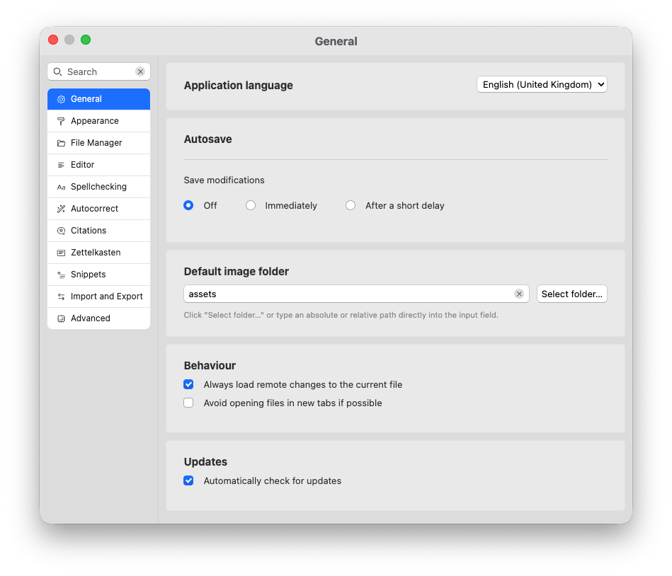
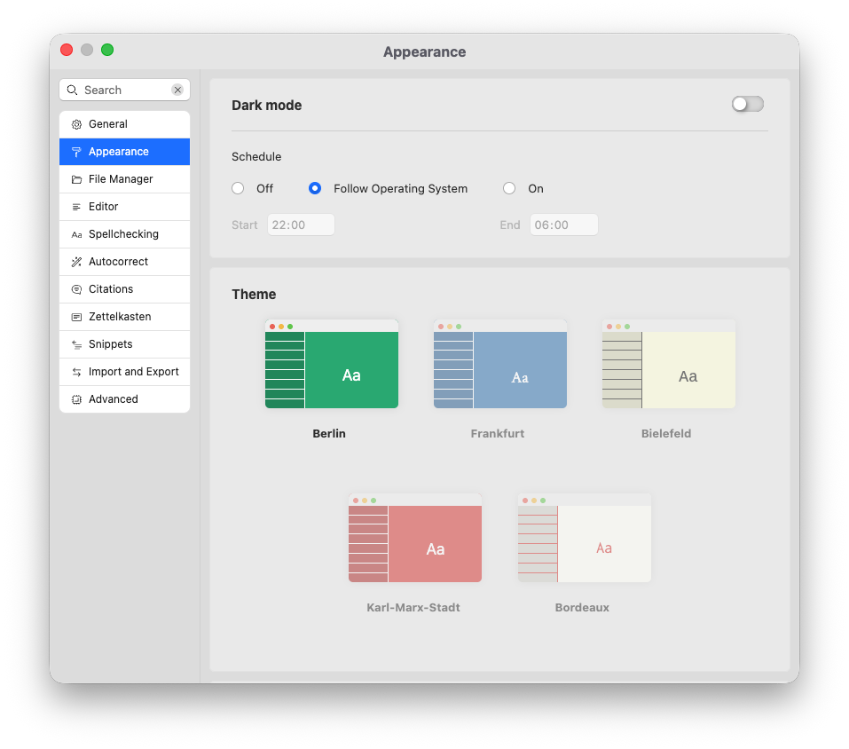
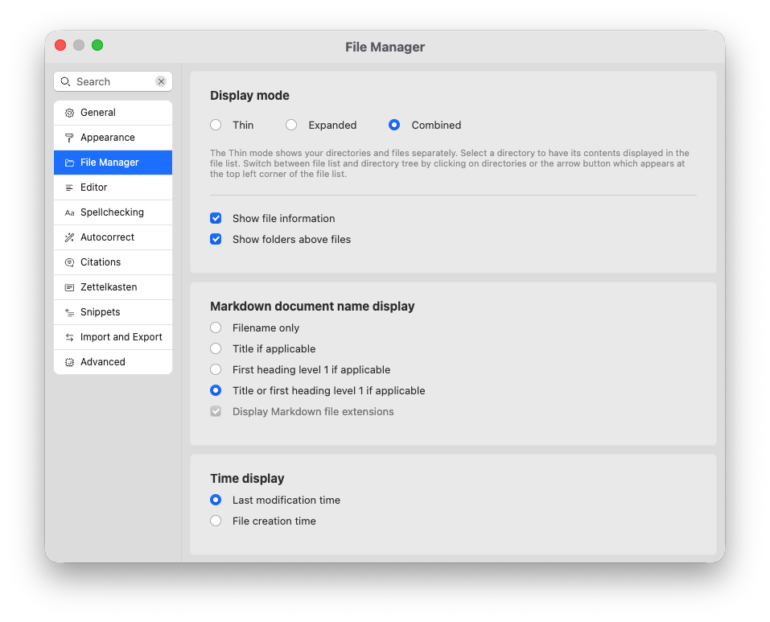
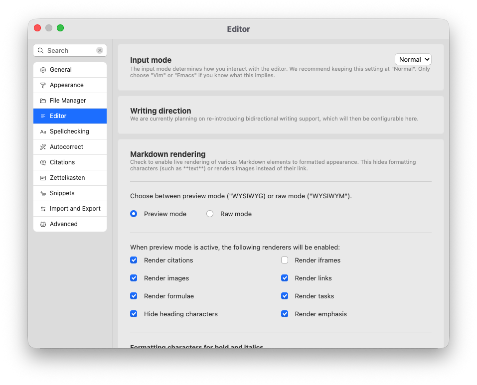
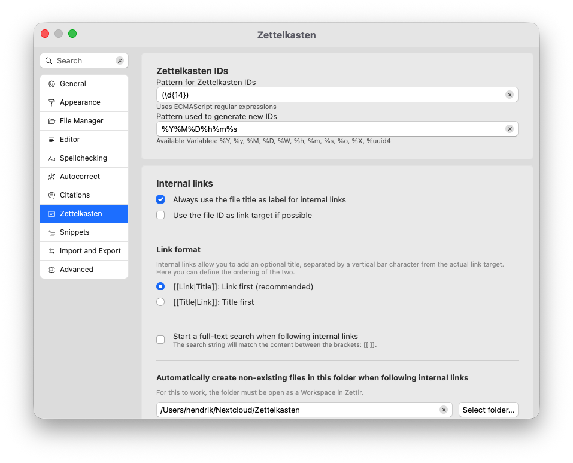
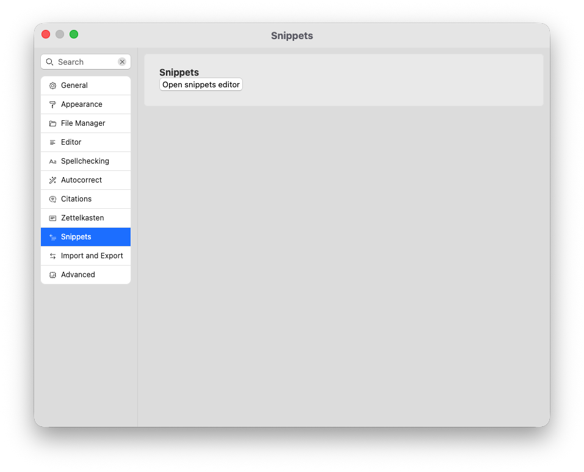
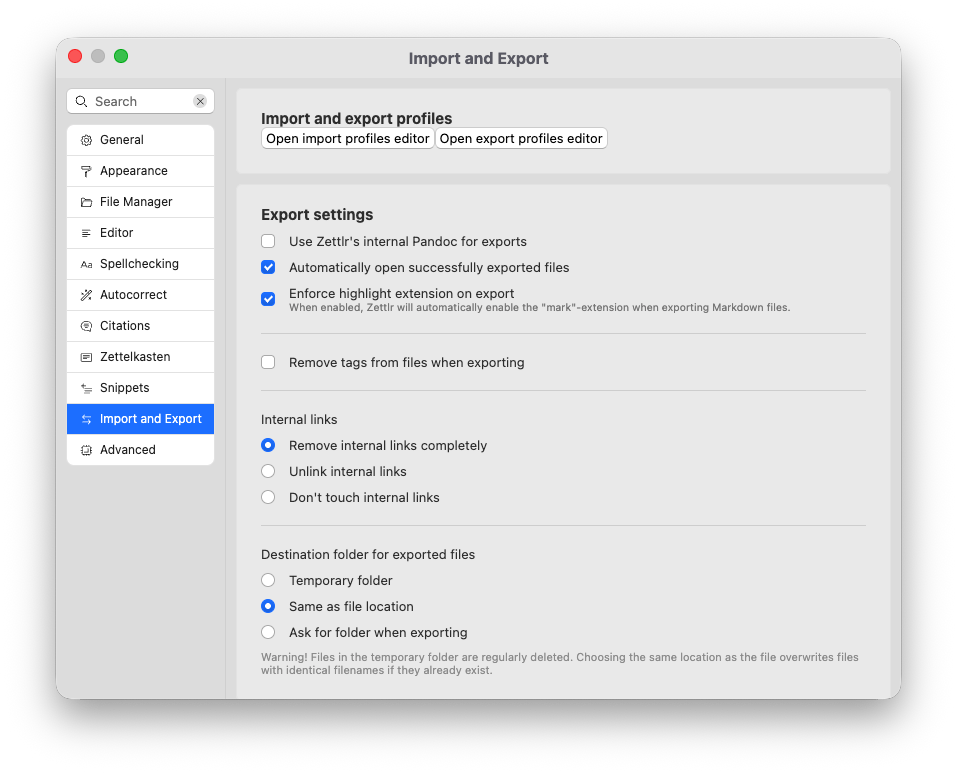
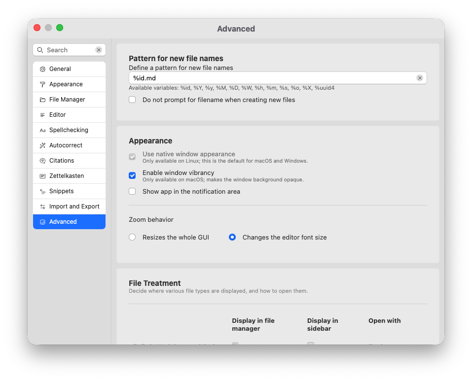

# Configurações

Neste documento de referência, descrevemos as várias preferências que o Zettlr possui.

## Navegando na janela de opções

A janela de seleção agrupa todas as configurações disponíveis por categorias e “cartões” de configurações.

Você pode navegar pela janela de duas maneiras. Você pode clicar nas categorias da lista à esquerda e percorrer todas as configurações que fazem parte desta categoria. Ou você pode inserir um termo de pesquisa na barra de pesquisa para filtrar todas as configurações com base no conteúdo do texto.

A seguir, descrevemos cada configuração com base em suas categorias.

**Observação:**

    As configurações podem ter nomes diferentes no seu idioma.

## Em geral

Configurações gerais relacionadas ao aplicativo.

Idioma do aplicativo

: define o idioma usado para todo o aplicativo. Solicite uma reinicialização.

Salvamento automático

: determine se você precisa salvar os arquivos manualmente usando <kbd>Cmd/Ctrl</kbd>+<kbd>S</kbd> ou se o Zettlr salvar automaticamente os arquivos de forma agressiva (“imediatamente”) ou com um pequeno atraso. Este último necessitará de menos recursos.

Pasta de imagens padrão

: Especifique um caminho relativo ou absoluto que será considerado a pasta de imagens padrão. O padrão, “ativos” significa que o Zettlr salvará as imagens em uma pasta “ativos” relativa ao arquivo Markdown em questão.

Comportamento

: defina algumas configurações comportamentais gerais para o aplicativo. “Sempre carregar alterações remotas” significa que o Zettlr recarregará automaticamente quaisquer alterações externas em documentos atualmente abertos em seus editores. Se desligado, você precisa confirmar se as alterações serão recarregadas. A configuração “evitar abrir arquivos em novas orientações” substituirá o documento atualmente aberto quando você abrir outro.

Atualizações

: controle se o Zettlr verifica automaticamente novas atualizações. *Desative esta configuração se você instalou o Zettlr por meio de um gerenciador de pacotes. O gerenciador de pacotes poderá atualizar o Zettlr para você.*

##Aparência

Controle o comportamento visual do Zettlr.

Modo escuro

: controla se o aplicativo será usado em um tema escuro ou claro. Use uma configuração de programação para determinar se o Zettlr alterna automaticamente entre os modos claro e escuro. “Seguir sistema operacional” significa que o Zettlr alternará entre os modos claro e escuro assim como seu sistema operacional o fará. Você também pode agendar manualmente com a configuração “Ligado”. Determine o horário em que o modo escuro deve ser ativado (relógio de 24 horas) e quando deve retornar ao modo claro (também relógio de 24 horas).

Tema

: Determina o tema do editor. Estas são configurações selecionadas que determinam a família da fonte, o tamanho e algumas opções de núcleos no editor.

Opções da barra de ferramentas

: permite ativar ou desativar os botões da barra de ferramentas conforme necessário. Alguns botões da barra de ferramentas são obrigatórios e não podem ser desativados aqui.

Barra de status

: determine se o Zettlr mostrará uma barra de status para documentos.

CSS personalizado

: fornece um atalho para abrir um guia CSS personalizado do gerenciador de ativos.

## Gerenciador de arquivos

Controle o comportamento do gerenciador de arquivos.

Modo de exibição

: selecione o modo de exibição do gerenciador de arquivos. “Thin” mostra apenas uma árvore de pastas ou uma lista de arquivos. “Expandido” mostra uma árvore de pastas e uma lista de arquivos. “Combinado” mostra pastas e arquivos intercalados em uma árvore de diretórios.

Mostrar informações do arquivo

: mostra metadados na lista de arquivos, se ativos.

Mostrar pastas acima dos arquivos

: determina se as pastas são descrições acima dos arquivos no gerenciador de arquivos. Se desativado, as pastas serão exibidas intercaladas com seus arquivos, opções de acordo com suas configurações.

Exibição do nome do documento Markdown

: determine como o Zettlr exibe seus documentos Markdown no gerenciador de arquivos. “Somente nome do arquivo” significa que sempre usaremos simplesmente o nome do arquivo. Se esta opção estiver selecionada, você também pode determinar se o Zettlr deve mostrar as extensões dos arquivos ou ocultá-las. “Título, se aplicável” usa a propriedade `title` do assunto YAML, se disponível; caso contrário, use o nome do arquivo. “Primeiro título nível 1, se aplicável” usa o primeiro título nível 1 como nome do arquivo, se disponível; caso contrário, use o nome do arquivo. “Título ou primeiro título nível 1, se aplicável” usa a propriedade `title`, se disponível, então o primeiro nível de título 1, e somente se nenhum estiver disponível, ele volta para o nome do arquivo.

Exibição de hora

: para indicar quando um arquivo foi modificado ou criado pela última vez, selecione a opção desejada aqui. Isso afeta tanto a exibição no gerenciador de arquivos quanto o carimbo de dados/hora usado para classificar os arquivos com base na hora.

Classificando

: Ao classificar o conteúdo da pasta por nome, selecione se deseja usar uma ordem ASCII simples ou uma ordem mais natural que leve em consideração grupos lógicos.

## Editor

Controle o comportamento do editor.

Modo de entrada

: Escolha entre normal, Vim e Emacs. O Emacs define diferentes atalhos de teclado para navegar em seus documentos. O Vim oferece uma experiência de edição completamente diferente. Recomendamos “Normal” para a maioria dos usuários.

Renderização de redução

: determina como o Markdown será renderizado. “Preview” significa que o Zettlr mostrará uma experiência de rich text, “raw” significa que o Zettlr mostrará uma sintaxe do Markdown. Quando “Visualizar” é selecionado, você pode ajustar quais elementos devem ser renderizados.

Formatando caracteres para negrito e itálico

: Markdown permite formato negro e itálico com sublinhados ou asteriscos. Esta configuração seleciona quais caracteres o Zettlr usa quando você usa atalhos de teclado para deixar o texto em negrito ou itálico.

Verifique Markdown para problemas de estilo

: se ativado, o Zettlr executará um linter informando se seus documentos Markdown estão formatados corretamente.

Editor de Tabela

: ativo para renderizar tabelas Markdown usando elementos reais da tabela. Esta configuração também é controlada pelo modo de renderização (as tabelas não serão renderizadas se você mudar para “raw”).

Modo sem distrações

: controla como funciona ou modo sem distrações. Você pode silenciar as linhas não focadas e ocultar a barra de ferramentas no modo sem distrações.

Contador de palavras

: determina se os contadores de palavras mostram palavras ou caracteres. Internamente, o Zettlr sempre contará ambos. Além disso, uma barra de status sempre mostrará os dois.

Modo de legibilidade

: selecione o algoritmo a ser usado ao usar o modo de legibilidade.

Tamanho da imagem

: Use isto para restringir imagens a um tamanho máximo dentro do editor, independentemente do tamanho real da imagem.

Tamanho da fonte

: Define o tamanho da fonte do editor.

Tamanho do recuo

: determine quantos espaços o Zettlr irá inserir quando você recuar usando <kbd>Tab</kbd>. Você também pode inserir guias.

Mostrar barra de ferramentas de formatação quando o texto for selecionado

: exibe uma pequena barra de ferramentas com algumas ferramentas de formatação comuns ao lado do texto selecionado. Semelhante ao Microsoft Word.

Mostrar números de linha para arquivos Markdown

: Quando ativado, o Zettlr também mostrará números de linha em arquivos Markdown. Zettlr sempre mostra números de linha para arquivos de código.

Destacar espaço em branco

: marque para que o Zettlr destaque os espaços em branco em seus documentos.

Sugerir emojis durante o preenchimento automático

: ativo para incluir emojis ao preencher automaticamente usando o caractere de dois pontos.

Mostrar visualizações de links

: se estiver ativado, o Zettlr entrará em contato com o servidor por trás de um link para exibir uma visualização detalhada do link. Desligue para evitar que o Zettlr entre em contato com os sites antes de visitar o link.

Fechar automaticamente pares de caracteres correspondentes

: Se ativado, caracteres como colchetes serão inseridos automaticamente em pares. Pode tornar a escrita de links ou outros elementos sintáticos mais rapidamente.

## Verificação ortográfica

Ajuste a verificação ortográfica e outras ferramentas de idioma.

Ferramenta de idioma

: Controle a integração do LanguageTool. Se ativado, o Zettlr executará seu texto por meio do LanguageTool para fornecer feedback gramatical e ortográfico rico.

Rigor

: Escolhe entre um modo “Padrão” básico e um modo “Exigente” mais rigoroso. Controle quantas sugestões o LanguageTool fornece.

Língua materna

: Selecione seu próprio idioma nativo. Ajuda o LanguageTool para verificar possíveis falácias, como “falsos amigos”.

Variantes preferidas

: ajuda o LanguageTool para determinar qual idioma você provavelmente quis dizer ao digitar um deles.

Provedor de LanguageTool

: selecione um provedor para o LanguageTool. Você pode escolher seus servidores oficiais ou selecionar um servidor personalizado aqui.

LanguageTool Premium

: Se você assinar o LanguageTool, insira seu nome de usuário e chave de API aqui para obter mais comentários sobre seu texto. Observe que o Zettlr irá ignorar seu servidor personalizado se você inserir algo aqui. Deixe esses campos em branco para usar um servidor personalizado.

LanguageTool: regras ignoradas

: mostra uma lista de todas as regras que você desativou no editor. Clique no botão para reativar a regra.

Correção ortográfica

: permite selecionar dicionários compatíveis com Hunspell para verificações ortográficas simples.

Dicionário do usuário

: contém todos os termos que você adicionou ao dicionário do usuário. Clique no botão para removê-los.

## Autocorreção

Controle suas configurações de autocorreção e Magic Quotes.

Correção automática

: é ativado, executa correções automáticas e ativa aspas mágicas.

Citações inteligentes

: controla quais aspas tipográficas que o Zettlr insere conforme você digita.

Padrões de substituição de texto

: Controla quais sequências de caracteres o Zettlr substituirá por quais. Você pode adicionar novos padrões com os campos de texto na parte inferior da tabela.

Combine palavras inteiras

: Se estiver ativo, o Zettlr nunca substituirá partes de palavras.

## Citações

Controlar as configurações relacionadas às solicitações

Preenchimento automático de solicitações

: controle como o Zettlr preencha automaticamente as chaves de citação quando você aceitar uma sugestão. Isso fará com que o Zettlr adicione a estrutura em torno das restrições para que você precise.

Banco de dados de solicitações

: selecione um arquivo CSL JSON, BibTeX ou BibLaTeX para que o Zettlr possa oferecer citações e informar ao Pandoc como formatar suas remessas durante a exportação.

Estilo CSL

: forneça um estilo CSL em [zotero.org/styles](https://www.zotero.org/styles) para personalizar como suas especificações serão formatadas. Aplique-se apenas durante as exportações.

## Zettelkasten

Controle a funcionalidade relacionada ao PKMS do Zettlr.

IDs de Zettelkasten

: diga ao Zettlr como ele deve gerar IDs para seus arquivos. Além disso, forneça ao Zettlr uma expressão regular que ele pode usar para identificar seus IDs.

Links internos

: controlar como o Zettlr é necessário automaticamente quando você cria um link interno. Quando “Sempre usar o título do arquivo como rótulo para links internos” estiver ativo, o Zettlr inserirá o nome do arquivo ou ID como destino do link, bem como o título do arquivo como rótulo do link. Se desligado, o Zettl fornecerá apenas o destino do link. “Usar o ID do arquivo como destino do link” controla se o Zettlr sempre usará apenas nomes de arquivo para vincular arquivos ou se usará o ID do arquivo, se disponível.

Formato do link

: controla como os links do seu sistema funcionam. A maioria dos sistemas permite os links primeiro, mas alguns sistemas são desativados para que o título do link seja instalado primeiro. Se você precisar interagir com esse sistema, altere esta configuração de acordo.

Inicie uma pesquisa de texto completo ao seguir links internos

: Se você estiver ativo, o Zettlr não apenas seguirá um link se você clicar com <kbd>Cmd/Ctrl</kbd>, mas também procurará o conteúdo deste link na pesquisa global.

Crie automaticamente arquivos inexistentes nesta pasta ao seguir links internos

: especifica uma pasta na qual o Zettlr criará arquivos que ainda não existem quando você clicar em um link para um arquivo inexistente. A pasta deve ser transmitida no Zettlr.

## Trechos

Fornecemos apenas um atalho para abrir o guia de snippets do gerenciador de ativos.

## Importação e Exportação

Controle o comportamento do mecanismo de importação/exportação.

Importar e exportar perfis

: contém atalhos para as guias de importação e exportação do gerenciador de ativos.

Use o Pandoc interno do Zettlr para exportações

: Se você desabilitar esta configuração, o Zettlr usará o Pandoc instalado separadamente em seu computador para exportações.

Abra automaticamente arquivos exportados com sucesso

: se ativado, o Zettlr abre automaticamente os arquivos após a exportação. Não se aplica a exportações de projetos.

Aplicar extensão de destaque na exportação

: controla se os destaques serão reconhecidos (`==mark==`) na exportação. Ativará à força a extensão `mark` durante as exportações, independentemente das configurações no perfil.

Remover tags de arquivos ao exportar

: Controla ou filtro Lua para remoção de tags. Quando marcado, o filtro removerá todas as tags encontradas. Se desativado, deixa as tags como estão.

Links internos

: Controla o comportamento do filtro Lua do link. “Remover completamente” significa que ele atuará como o filtro de tags e removerá totalmente os links. “Desvincular” significa que substituirá os links apenas pelo destino do link. “Não toque” significa que o filtro não modificará seus links de alguma forma.

Pasta de destino para arquivos exportados

: controlará para onde o Zettlr exportará seus arquivos. “Pasta temporária” significa que eles serão removidos pelo seu computador se você não usar os arquivos. “Igual ao local do arquivo” significa colocar o arquivo exportado na mesma pasta do arquivo de origem. “Ask” exibirá uma caixa de diálogo de seleção de massas na exportação.

Comandos de exportação personalizados

: permite especificar comandos personalizados para contornar o próprio mecanismo de exportação do Zettlr.

## Avançado

Controle diversas configurações avançadas.

Padrão para novos nomes de arquivos

: determina como o Zettlr calcula novos nomes de arquivos.

Não solicite nome de arquivo ao criar novos arquivos

: por padrão, você tem a oportunidade de escolher um nome de arquivo diferente. Selecione esta opção para que o Zettlr crie o arquivo imediatamente.

Use a aparência nativa da janela

: Disponível apenas no Linux. Se selecionado, o Zettlr usará as decorações de janela padrão de sua distribuição. Se desativado, o Zettlr renderizará seu próprio cromo da janela.

Ativar vibração da janela

: torna o plano de fundo das janelas no macOS bastante transparente.

Mostrar aplicativo na área de notificação

: se ativado, exibe um ícone do Zettlr na barra de menu (no macOS) ou na área da bandeja (no Windows e Linux).

Comportamento de zoom

: O que acontece quando você pressiona <kbd>Cmd/Ctrl</kbd>+<kbd>+</kbd> e <kbd>Cmd/Ctrol</kbd>+<kbd>-</kbd>.

Tratamento de arquivos

: controle onde o Zettlr exibe quais tipos de arquivos e como ele será aberto quando você clicar neles. “Exibir no gerenciador de arquivos” faz com que esses arquivos se aplicam no gerenciador de arquivos. “Exibir na barra lateral” mostra esses arquivos na barra lateral. “Abrir com” determina se o Zettlr abrirá os arquivos internamente ou permitirá que seu computador abra com o aplicativo padrão do sistema.

Extensões de nome de arquivo personalizadas

: esse controle permite especificar extensões de nome de arquivo adicionais e arbitrárias para os arquivos que serão exibidos. Esses arquivos serão mostrados apenas na barra lateral.

Lista de permissões de renderização de iframe

: por padrão, o Zettlr perguntará antes de carregar qualquer iframe por motivos de segurança. Este controle lista todos os domínios que o Zettlr não solicitará antes de carregar imediatamente o iframe. Isso deve incluir apenas domínios confiáveis. Remova tudo para segurança máxima.

Pesquisa de vigilância

: Obsoleto.

Excluindo itens

: Principalmente relevante para distribuições Linux onde a funcionalidade “lixo” é opcional. Se nenhuma pasta de lixo for especificada, a exclusão de arquivos falhará. Habilite esta configuração para excluir os itens de forma irreversível nesse caso.

Modo de depuração

: ativa o modo de depuração. Fornece um novo menu de aplicativo (“Desenvolver”) e mostra “Inspecionar elemento” nos menus de contexto.

Versões beta

: oferece a instalação de versões beta, se marcada. Só funciona se você ativar as verificações de atualização.