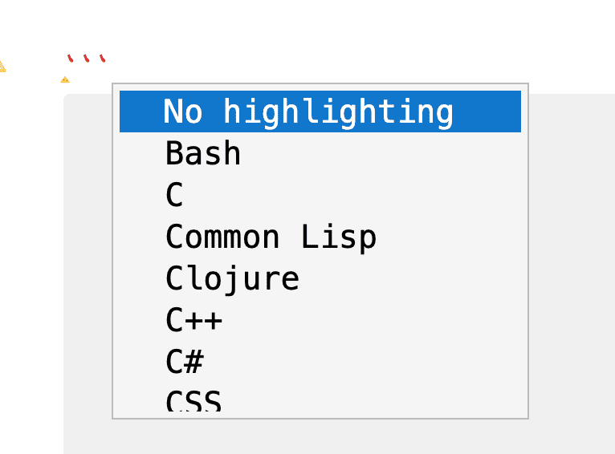

# Blocos de Código

Como muitos outros editores baseados em Markdown, o Zettlr permite inserir código de computador em seus documentos. Você pode usar isso, por exemplo, para adicionar exemplos de código a guias ou documentação técnica, fornecer código R ou Python para documentar pacotes CRAN ou Python, ou para adicionar diagramas a eles. O Zettlr tratará seus blocos de código de maneira especial e fornecerá destaque de sintaxe ao código para facilitar a leitura.

## Inserindo Blocos de Código

Os blocos de código do Zettlr são simplesmente [Blocos de Código Protegidos](https://spec.commonmark.org/0.31.2/#fenced-code-blocks) de acordo com o CommonMark. Você pode inseri-los usando crases (<code>\`</code>) ou tildes (`~`):

<!-- Note: Indended to ensure the backticks are rendered -->
    ```typescript
    function myFunction (arg: string|number): boolean {
      return typeof arg === 'string'
    }
    ```

Você precisa usar pelo menos três crases ou três caracteres de til para iniciar e encerrar um bloco de código protegido. Consulte a [especificação](https://spec.commonmark.org/0.31.2/#fenced-code-blocks) para saber todas as regras para criar blocos de código.

## Fornecendo uma tip de Linguagem na Info String

Como você pode ver no exemplo acima, o início do bloco de código pode ser seguido por uma chamada “info string”. Essa info string dá ao aplicativo uma tip sobre qual linguagem de programação o bloco de código contém. Isso ativa o destaque de sintaxe. Se você não fornecer essa info string, o destaque de sintaxe será desativado.

**Observação:**

	Alguns sistemas tentarão adivinhar a linguagem do código se você não fornecer essa info string. Isso significa que, ao sair do contexto do Zettlr, outros sistemas podem tentar impor o destaque de sintaxe.

Para garantir que seu código seja destacado corretamente, você precisa fornecer o identificador de linguagem correto na info string. No momento da redação, o Zettlr oferece suporte ao destaque de sintaxe para 53 linguagens diferentes. Isso pode dificultar lembrar todas as info strings, especialmente porque o Zettlr às vezes oferece vários identificadores para a mesma linguagem (por exemplo, `typescript` e `ts`).

Para facilitar a inserção de blocos de código, o Zettlr fornece todas as linguagens de programação disponíveis por meio de um menu de correção automática. Sempre que você começa um bloco de código protegido, o Zettlr exibirá automaticamente uma lista de todos os identificadores de linguagem disponíveis. Para filtrar a lista, você pode começar a digitar o identificador real da linguagem ou o nome da linguagem:



Quando você seleciona a linguagem correta no autocomplete, o Zettlr insere seu identificador na info string e também insere automaticamente os caracteres de fechamento do bloco de código, economizando tempo ao inserir código.

## Variante de Info String: Atributos de Código

Há uma variante de info string que somente o Pandoc (e o Zettlr) suportam, e ela oferece mais liberdade para ajustar seu texto. Por exemplo, às vezes você pode querer adicionar atributos ou classes adicionais ao bloco de código. Dependendo do destino da exportação do documento, isso pode ser útil. Essa variante é chamada de [“Atributos de bloco protegido”](https://pandoc.org/MANUAL.html#extension-fenced_code_attributes). Para usar essa variante de info string, envolva-a em chaves (`{}`) e use a sintaxe de classe do Pandoc para fornecer sua info string.

Exemplo:

    ```{.typescript}
    function myFunction (arg: string|number): boolean {
      return typeof arg === 'string'
    }
    ```

## Linguagens Disponíveis

A seguir está a lista de todas as linguagens de destaque suportadas no momento da redação, com as strings de info de código correspondentes:

* **C**: `c`
* **C#**: `c#`, `csharp`, `cs`
* **C++**: `cpp`
* **Clojure**: `clojure`
* **COBOL**: `cobol`
* **Common Lisp**: `clisp`, `commonlisp`
* **CSS**: `css`
* **Dart**: `dart`, `dt`
* **Diffs**: `diff`
* **Arquivos Docker**: `docker`, `dockerfile`
* **Elm**: `elm`
* **F#**: `f#`, `fsharp`
* **Fortran**: `fortran`
* **Go**: `go`
* **Haskell**: `haskell`, `hs`
* **HTML**: `html`
* **Java**: `java`
* **JavaScript**: `javascript`, `js`, `node`
* **Julia**: `julia`, `jl`
* **Kotlin**: `kotlin`, `kt`
* **LaTeX**: `latex`, `tex`
* **LESS**: `less`
* **LUA**: `lua`
* **Markdown**: `markdown`, `md`
* **Diagramas Mermaid**: `mermaid`
* **Nix**: `nix`
* **Objective-C**: `objective-c`, `objectivec`, `objc`
* **Octave**: `octave`
* **Pascal**: `pascal`
* **Perl**: `perl`, `pl`
* **PHP**: `php`
* **PowerShell**: `powershell`
* **Python**: `python`, `py`
* **R**: `r`
* **Ruby**: `ruby`, `rb`
* **Rust**: `rust`, `rs`
* **Scala**: `scala`
* **Scheme**: `scheme`
* **SCSS**: `scss`
* **Shell**: `shell`, `sh`, `bash`
* **Smalltalk**: `smalltalk`, `st`
* **SPARQL**: `sparql`
* **SQL**: `sql`
* **Swift**: `swift`
* **TCL**: `tcl`
* **TOML**: `toml`, `ini`
* **Turtle**: `turtle`, `ttl`
* **TypeScript**: `typescript`, `ts`
* **Verilog**: `verilog`, `v`
* **VHDL**: `vhdl`, `vhd`
* **Visual Basic**: `vb.net`, `vb`, `visualbasic`
* **XML**: `xml`
* **YAML**: `yaml`, `yml`
