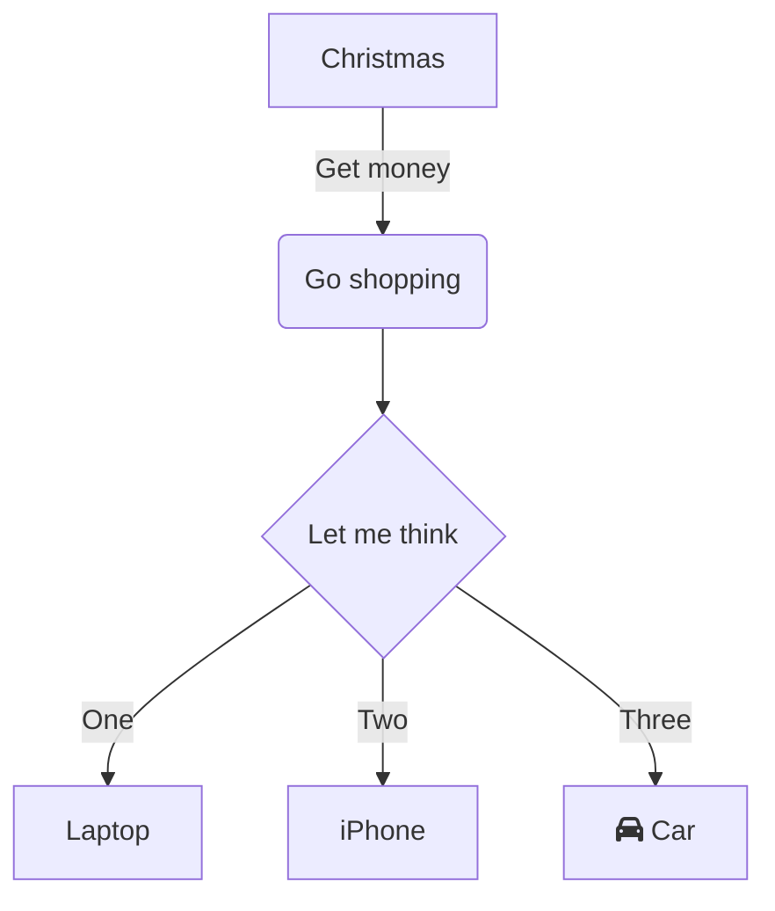
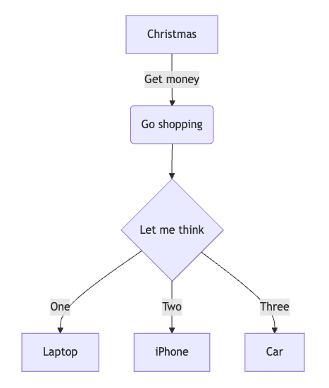

# Diagramas de sereia

Muitas vezes, ter uma maneira de esboçar rapidamente um diagrama pode ser útil tanto para aplicações científicas quanto técnicas. Para isso, o Zettlr vem com suporte integrado para fazer diagramas Mermaid. Mermaid.js é uma alternativa a outras soluções de diagramas, como UML ou draw.io.

Os diagramas Mermaid usam uma linguagem de marcação que permite especificar o diagrama, que o mecanismo Mermaid irá então renderizar.

Isso significa que o Zettlr utiliza blocos de código para criar diagramas Mermaid.

## Renderizando Sereia

Zettlr pode renderizar um diagrama Mermaid no local. Para isso, certifique-se de que o renderizador correspondente esteja ativo e que o modo de renderização esteja definido como “Visualização” e não “bruto”.

O seguinte exemplo de fluxograma:



Irá renderizar assim:



O realce de sintaxe para diagramas Mermaid não é suportado.

## Renderizando Sereia na Exportação

Uma dificuldade com o Mermaid é que, embora o Zettlr suporte a renderização de diagramas Mermaid prontos para uso, muitos outros sistemas não. Consulte a documentação do Mermaid sobre como ativar a renderização de diagramas em vários contextos.

Para permitir a renderização do Mermaid ao exportar documentos usando Pandoc diretamente do Zettlr, você precisará usar um filtro Lua para adicionar suporte ao Mermaid.

Aqui segue um exemplo de filtro que você pode usar. No entanto, observe que não oferecemos suporte para esse filtro. Pode parar de funcionar a qualquer momento.

Para usar este filtro, você precisará instalar o utilitário CLI Mermaid.js (`mmdc`). Se precisar de ajuda, pergunte à comunidade, mas não abra um problema no GitHub.

```lua
-- Lua filter to enable Pandoc Mermaid support during exports
local supported_formats = {
  svg = { "svg", "image/svg+xml" },
  png = { "png", "image/png" },
  pdf = { "pdf", "application/pdf" }
}

local default_formats = {
  html = supported_formats["svg"],
  latex = supported_formats["pdf"],
  beamer = supported_formats["pdf"]
}

local function get_format (format)
  if supported_formats[format] then
    return supported_formats[format]
  else
    return supported_formats["png"]
  end
end

local function render_mermaid (code, filetype, width, height, scale)
  local w = width or "800"
  local h = height or "600"
  local s = scale or "1P"
  local output = pandoc.pipe("mmdc", {
    "-e", filetype, "--width", w, "--height", h,
    "--scale", s,
    "-i", "-", "-o", "-"
  }, code)
  return output
end

function CodeBlock(block)
    if block.classes[1] == "mermaid" then
      local default_format = get_format(FORMAT)
      local filetype = default_format[1]
      local mimetype = default_format[2]
      if block.attr['format'] then
        local custom_format = get_format(block.attr['format'])
        filetype = custom_format[1]
        mimetype = custom_format[2]
      end

      local img = render_mermaid(block.text, filetype, block.attr['export_width'], block.attr['export_height'], block.attr['export_scale'])
      local fname = pandoc.sha1(img) .. "." .. filetype
      pandoc.mediabag.insert(fname, mimetype, img)
      local image = pandoc.Image({ pandoc.Str("Mermaid diagram") }, fname, "", block.attr)
      return pandoc.Figure({ image }, pandoc.Caption())
    end
end
```