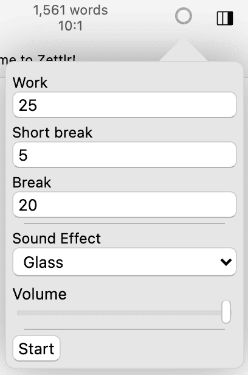
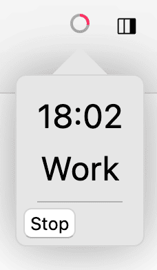

# Temporizador Pomodoro

Se você escreve muito, provavelmente já se sentiu cansado ao escrever devido às longas horas de trabalho. Para combater isso, Francesco Cirillo desenvolveu uma técnica de chamada [técnica Pomodoro](https://francescocirillo.com/pages/pomodoro-technique) que divide sessões longas em intervalos (com pausas). Isso permite que o cérebro se atualize e ajude a evitar o esgotamento. Funciona da seguinte maneira:

1. Trabalho (normalmente 25 minutos)
2. Pequeno intervalo (normalmente de 5 a 10 minutos)
3. Repita (3 vezes)
4. Pausa longa (normalmente de 25 a 30 minutos)
5. Repita a partir da Etapa 1

Zettlr simplifica esse processo com um temporizador Pomodoro integrado.

## Usando o temporizador Pomodoro

Acesse o cronômetro Pomodoro clicando no círculo no canto superior direito da tela, dentro da barra de ferramentas. O temporizador Pomodoro possui 3 configurações principais que podem ser ajustadas:

- A duração do **Trabalho**, **Pausa Curta** e **Pausa** pode ser ajustada inserindo o tempo (em minutos) em suas respectivas caixas de texto.
- Após cada fase, um **efeito sonoro** é reproduzido, que pode ser escolhido no menu suspenso (vidro, alarme digital e campainha).
- Ajuste o **volume** com o controle deslizante (esquerda significa silenciado). Quando você alterar isso, o som selecionado será reproduzido para indicar o volume.

**Observação:**

    Este não é o volume do seu sistema, portanto, se o volume do seu sistema estiver apenas em 20%, mesmo um volume de 100% dentro do Zettlr soará apenas 20%.

Clique em **Iniciar** para iniciar o cronômetro. Em seguida, o círculo será preenchido com a cor da fase atual (vermelho, amarelo ou verde). Quando estiver cheio, a próxima fase será avaliada.

Para **Parar** o cronômetro ou simplesmente verificar o **status** atual do cronômetro, clique no círculo. Um pequeno pop-up mostra o tempo restante da fase atual, o tipo de fase atual e dará a opção de interrupção da sessão.

