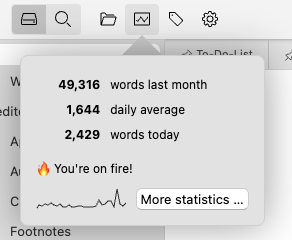
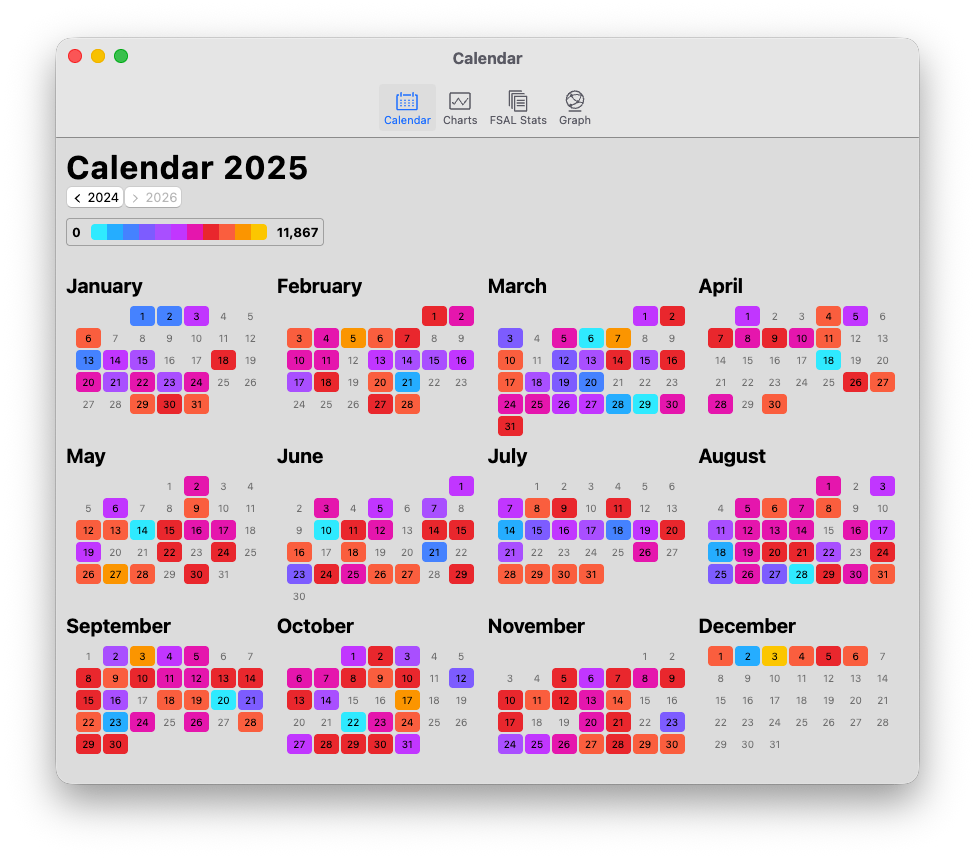
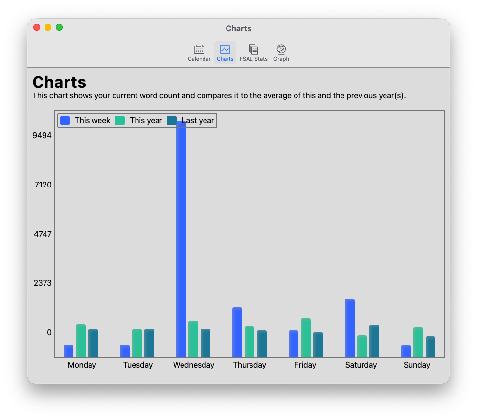

# Escrevendo estatísticas

Zettlr oferece um conjunto de estatísticas básicas de escrita que podem ajudá-lo a entender a maneira como você escreve. Existem estatísticas baseadas em quanto você escreve no dia a dia, bem como estatísticas gerais sobre os espaços de trabalho e arquivos abertos no aplicativo.

O aplicativo rastreia continuamente sua escrita ao longo do dia. Estas estatísticas são relativamente simples e não pretendem ser precisas. Eles servem apenas como indicadores de seu comportamento amplo de escrita e não devem ser considerados nada mais do que isso.

## Como o Zettlr rastreia sua escrita

Zettlr usa um algoritmo muito simples para lembrar quantas palavras e caracteres você escreve ao longo do dia. Começa quando você abre um documento. À medida que o aplicativo abre um documento, ele calcula uma contagem de palavras como linha de base. Então, quando você salva um documento – usando o salvamento automático ou pressionando manualmente <kbd>Cmd/Ctrl</kbd>+<kbd>S</kbd> – o aplicativo calculará uma nova contagem de palavras. O que ele rastreará é a diferença entre esses dois números. Ele registra apenas valores positivos, portanto, se você excluir mais palavras do que adicionou, não subtrairá nenhum valor dos registrados.

Esta estratégia é bastante simples e direta, mas vem com algumas ressalvas:

* Se você colar grandes quantidades de texto, isso poderá aumentar suas estatísticas.
* Os contadores são específicos para serem rápidos e não precisos, por isso empregam heurísticas muito básicas e podem não refletir com precisão, especialmente contagens de caracteres em escritas não latinas, como árabe, tâmil, chinês ou japonês.
* Até novembro de 2024, o Zettlr rastreava apenas contagens de palavras, não contagens de caracteres, portanto, havia uma diferença nos dados históricos

**Dica:**

    Se quiser adaptar suas estatísticas de escrita manualmente de acordo com o fato, você pode modificar o arquivo `stats.json` no diretório de dados do aplicativo. Observe que o Zettlr deve ser fechado antes que você possa adaptar o arquivo, caso contrário, o aplicativo substituirá suas alterações. Você pode encontrar o diretório de dados nas [instruções de configuração](../getting-started/setup.md).

## Visualizando suas estatísticas

Para acessar as estatísticas de escrita, clique no botão “Ver estatísticas” na seção esquerda da barra de ferramentas. Isso abrirá um popover que contém várias informações. Primeiro, algumas contas: a quantidade de palavras que você escreveu nos últimos 30 dias, sua mídia diária móvel nos últimos 30 dias e a quantidade de palavras que você escreveu hoje.

Como motivação adicional para começar a escrever, o popover também inclui uma mensagem negativa se você não chegou perto de sua mídia móvel, está chegando perto ou se ultrapassou sua mídia hoje.

Por último, o popover contém um pequeno gráfico que representa a quantidade de palavras nos últimos 30 dias para dar uma impressão visual do seu desempenho na escrita. No lado deste gráfico, você encontrará um botão que, ao ser clicado, abrirá uma janela completa de estatísticas.

## Uma janela de estatísticas

A janela de estatísticas contém muitos dados abrangentes sobre seus arquivos e seu processo de gravação. É também uma janela que inclui a [visualização do gráfico](../pkms/graph.md).

A primeira aba da janela de estatísticas mostra o calendário. Ele se concentra no ano atual e oferece uma visão geral de todo o ano em que você escreveu. Ele mostra os dias em que você não abriu o aplicativo em cinza e depois usa núcleos para transmitir a quantidade de palavras que você escreveu.

Zettlr usa um gradiente de núcleos básicos de mapa de calor para indicar sua atividade de escrita, com núcleos azuis estabeleceram dias menos ativos e amarelo marcaram dias muito ativos. Passe o mouse sobre os dias individuais para ver a quantidade real de palavras que você escreveu.

Usando os botões abaixo do título, você pode navegar todos os anos para ver quais dados existem. Isso permite comparar o ano atual com dados históricos.

A segunda aba da janela inclui as mesmas informações, mas na forma de gráficos de barras. O eixo x mostra os dias da semana, de segunda a domingo. Para cada dia da semana, fornece informações sobre a semana atual, os valores médios deste ano e os valores médios do ano anterior.

A terceira visualização contém dados sobre os arquivos que você carregou no aplicativo. Ele mostra uma variedade de estatísticas resumidas sobre arquivos, pastas e arquivos maiores e menores.

A quarta visualização contém a visualização gráfica. [Consulte a seção detipda nesta documentação para saber mais](../pkms/graph.md).