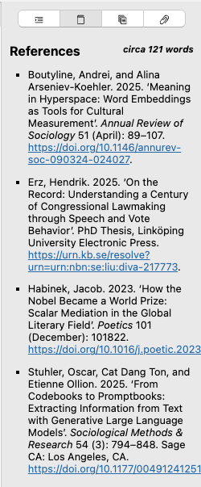

# Referências

O guia de referências contém uma bibliografia de todas as referências mencionadas no documento. Ele é gerado ao salvar seu documento e oferece uma seção bibliográfica prévia. Você também pode selecionar texto neste painel que permite copiar as referências.

Esta lista consiste em qualquer elemento citado em algum lugar do seu documento, mais os elementos `nocite`. Qualquer citekey válida que você colocar em um assunto YAML sob a chave `nocite` será adicionada à bibliografia, independentemente de você realmente citar o item em seu texto principal, de acordo com [como o Pandoc renderizará suas referências](https://pandoc.org/MANUAL.html#including-uncited-items-in-the-bibliography).

Para saber mais sobre como citar literatura com Zettlr, dê uma olhada na página da documentação de [citações](../editor/citations.md).

**Observação:**

    Observe que as referências serão exibidas usando o estilo CSL integrado. Se você especificou um estilo CSL personalizado, o Pandoc o usará durante uma exportação. As referências na barra lateral são para fins de visualização.