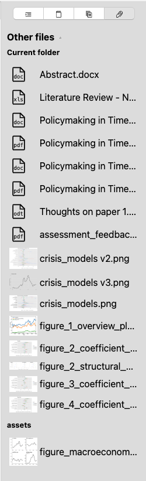
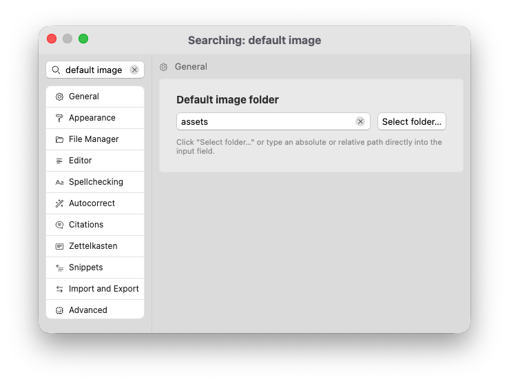

# Outros arquivos

O último guia da barra lateral mostra outros arquivos que residem nas proximidades do documento atual. Você pode definir quais arquivos aparecem na lista e clicar neles para visualizá-los ou arrastá-los para o editor atual para vinculá-los.

## Determinando quais arquivos exibir

O objetivo principal do nosso guia de arquivos é organizar seu gerenciador de arquivos. Embora o gerenciador de arquivos forneça uma visão dos arquivos em seu sistema de arquivos, ele oculta propositalmente muitos arquivos para ajudá-lo a se concentrar na gravação.

O guia contém qualquer arquivo que você não precisa imediatamente no gerenciador de arquivos, mas você deseja acessar com mais facilidade do que através do navegador de arquivos do seu computador. Isso afeta principalmente duas categorias de arquivos:

1. Arquivos que o Zettlr pode abrir somente para leitura ou que precisam ser abertos com um programa externo, mas que são centrais para seu fluxo de trabalho mais amplo.
2. Imagens.

Primeiro, algumas palavras sobre arquivos que não são de imagem. Dependendo do seu fluxo de trabalho, você pode contar com arquivos como planilhas do Excel, arquivos PDF ou arquivos de dados para progredir na sua escrita. A barra lateral oferece uma maneira de manter esses arquivos salvos, mas ainda acessíveis no Zettlr.

A seguir, imagens. Muitos fluxos de trabalho de escrita bloqueiam o acesso rápido às imagens. Podem ser imagens que você deseja incluir em seus documentos ou gráficos. A barra lateral oferece acesso rápido a esses arquivos. Além disso, o Zettlr pode mostrar uma prévia para que você possa ver o conteúdo da imagem antes de vinculá-la em seus documentos.

Você pode configurar quais arquivos serão mostrados aqui nas preferências → “Avançado” → “Tratamento de arquivos”.

Esta seção oferece dois controles:

1. Tipos de dados predefinidos (imagens, documentos PDF, documentos do Office e arquivos de dados). Você também pode optar por exibir esses arquivos diretamente no gerenciador de arquivos.
2. Extensões de nome de arquivo arbitrárias para arquivos personalizados que você considera relevantes. Essas extensões de nome de arquivo adicionais serão mostradas apenas na barra lateral.

## Locais de outros arquivos

Como a barra lateral é **sensível ao contexto** e mostra apenas arquivos relacionados ao documento atual, o conteúdo deste guia mudará assim que você alterar o documento atual.

Ele pesquisará outros arquivos em **dois locais**:

1. Uma pasta atual
2. Pasta de ativos

Primeiro, ele exibirá os arquivos correspondentes que estão na mesma pasta do documento atual. Em segundo lugar, ele exibirá os arquivos da “pasta de ativos”. Você mesmo pode definir essa pasta de ativos. Para fazer isso, vá em preferências → “Geral” → “Pasta de imagens padrão”.

Esta configuração permite determinar um caminho absoluto ou relativo que deve hospedar seus ativos (destinados principalmente a imagens).

É comum definir um caminho relativo – o padrão é apenas “ativos”. Isso significa que um guia de outros arquivos procurará a presença de uma pasta “ativa” na pasta atual. Se houver, ele exibirá todos os arquivos correspondentes desta pasta.

Caso você forneça um caminho absoluto como pasta de imagem padrão, ele permanecerá o mesmo para todos os documentos.