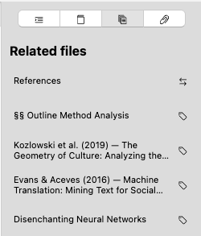
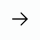
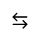

# Arquivos Relacionados

O guia de arquivos relacionados lista os arquivos que o Zettlr considera relacionados ao documento atual. Este guia da barra lateral é relevante principalmente para fluxos de trabalho Zettelkasten/PKMS. Ele ajuda você a navegar em seus arquivos não com base na estrutura hierárquica de pastas, mas na semelhança semântica com base em indicadores textuais. Este recurso pode ajudá-lo a identificar conexões entre documentos.

Um guia lista os nomes dos arquivos (ou títulos do assunto YAML ou títulos de nível 1, dependendo de suas preferências) do arquivo relacionado ao lado de um ícone que simboliza a natureza desse relacionamento.

Existem quatro tipos diferentes de relacionamentos, identificados pelos seguintes ícones:

| Relacionamento | Símbolo | Descrição |
|-----------------------|--------------------------|-----------|
| **Palavras-chave compartilhadas** |  | Dois arquivos podem estar relacionados se tiverem palavras-chave (ou tags) em comum. |
| **Link de entrada** |  | Um arquivo é considerado relevante se for fornecido um link para o documento atual. |
| **Link de saída** |  | Um arquivo é considerado relevante se os documentos atuais forem vinculados a ele. |
| **Link bidirecional** |  | Um arquivo é considerado relevante se tanto o documento atual estiver relacionado a ele quanto o arquivo relacionado estiver relacionado de volta ao documento atual. |

## Entendendo como o Zettlr calcula o relacionamento

O Zettlr usa uma variedade de sinais para determinar se dois arquivos estão relacionados. Os principais modos de relacionamento que o Zettlr utiliza são links wiki e palavras-chave ou tags.

### Palavras-chave compartilhadas

A forma mais comum de relacionamento é quando dois documentos coincidem com as mesmas palavras-chave ou tags. Depois de adicionar pelo menos uma palavra-chave que já existe em algum lugar em seus espaços de trabalho carregados ao documento atual, um guia de arquivos relacionados exibirá todos os outros documentos ou notas que foram marcados com esta palavra-chave.

Cada palavra-chave compartilhada entre dois arquivos aumenta a classificação do relacionamento. Quanto mais palavras-chave forem compartilhadas, mais acima nesta lista o arquivo relacionado será posicionado.

No entanto, palavras-chave são consideradas **sinais fracos** para indicar relacionamento. São relações implícitas que têm seu mérito, mas emergem dos conteúdos que você inseriu em suas anotações.

### Links explícitos

O único juiz sobre se dois arquivos podem ser relacionados é você, portanto, para tornar um relacionamento explícito, você utilizará links wiki, ou links Zettelkasten, ou links “internos”.

Zettlr considera links explícitos entre arquivos como **sinais fortes** de que dois documentos estão relacionados, portanto, qualquer forma de relacionamento de link será colocada em cima de qualquer relacionamento de tag.

Assim que você vincular seu documento atual a outro, ou seja, criar um link, você forma um relacionamento explícito entre os dois documentos. Isso é chamado de **link externo** (já que aponta para outro arquivo) e é considerado mais forte do que qualquer relacionamento baseado em palavras-chave compartilhadas.

O inverso deste link também é verdadeiro. Depois de abrir o arquivo relacionado, o guia de arquivos relacionados exibirá um **link de entrada** nos arquivos relacionados.

A forma mais forte de um link explícito entre dois arquivos é um **link bidirecional**, ou seja, ambos os arquivos fazem referência um ao outro. Assim, esse tipo de relacionamento sempre será ordenado no topo da lista de arquivos relacionados.