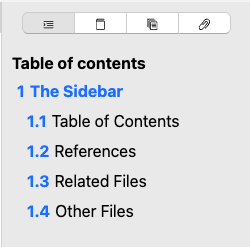

# Índice

O guia do índice contém uma visão estruturada do seu documento. Ele lista os títulos que você pode encontrar e os mostra em uma lista numerada.

Estas entradas são interativas; clicar neles vai diretamente para a seção correspondente no documento.

A seção onde o cursor está atualmente é destacada de acordo com o núcleo de destaque do aplicativo. Este destaque será atualizado conforme você mover o cursor pelo documento.

Por último, você também pode alterar a ordem das posições arrastando e liberando um título de uma posição para outra.