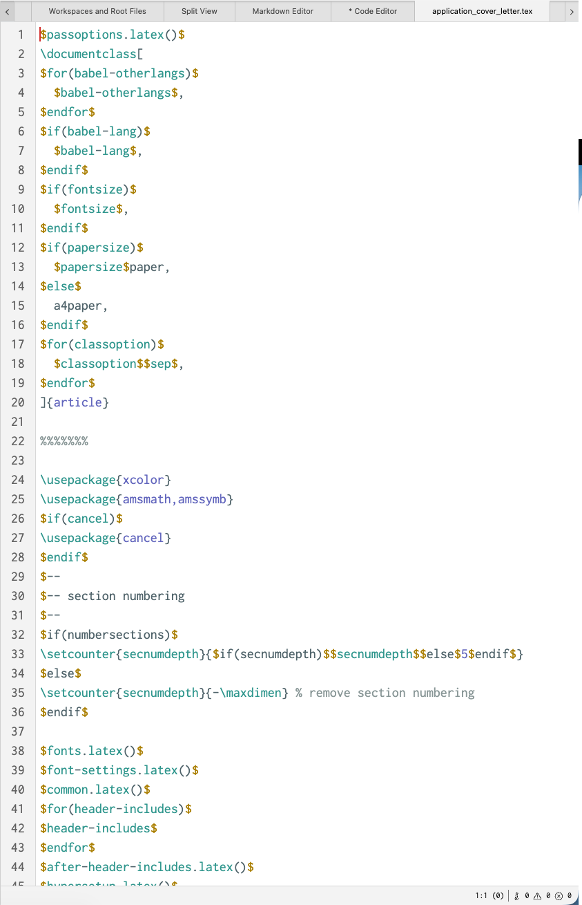

# Editor de código

O editor de código funciona de forma semelhante ao editor Markdown, mas para arquivos de código. A partir de agora, o Zettlr oferece suporte apenas a três tipos de arquivos de código: arquivos de dados JSON, arquivos de dados YAML e arquivos de origem LaTeX.

O editor de código permite editar confortavelmente os arquivos de código suportados. Ele suporta recuo automático, realce de sintaxe e sempre mostra números de linha.

Além disso, o editor de código apresenta a mesma barra de status do editor Markdown principal, se você ativá-lo. A barra de status mostra algumas informações, como posição do cursor ou resultados do linter.

Além dos recursos comuns, o editor de código também possui um linter. Um linter é uma ferramenta que verifica alguns códigos em busca de erros de sintaxe e os destaca para você.

Dessa forma, você pode encontrar e corrigir rapidamente quaisquer erros em seus arquivos.