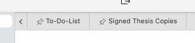

# Barra da guia do documento

Cada elemento dividido individual possui uma barra de guias na parte superior de seu editor de arquivos ou área de visualização. A barra da guia do documento mostra diretamente quais documentos estão abertos neste elemento dividido.

A barra de guias se comporta como qualquer outra barra de guias com a qual você já tenha interagido. Cada elemento mostra o nome do arquivo, o título do arquivo ou o primeiro nível de título 1 (dependendo de suas configurações) do arquivo. Você também pode fechar um documento usando o botão Fechar do elemento.

Além disso, você pode alterar a ordem dos seus documentos arrastando os elementos e soltando-os na posição desejada. As posições serão atualizadas conforme você avança para uma prévia de onde o elemento irá parar.

## Guias fixadas

Você também pode fixar guias. Para fazer isso, clique com o botão direito na guia que deseja fixar e selecione a opção correspondente no menu de contexto.

As guias fixadas mostrarão seu status com um ícone de alfinete. Além disso, as guias fixadas *sempre* serão movidas para o início das guias do documento. Você também pode classificá-los arrastando, assim como todas as outras guias, mas não pode mover guias fixadas atrás de guias não fixadas e vice-versa.

Fixar uma guia significa essencialmente que você não pode fechá-la acidentalmente – nem pressionando <kbd>Cmd/Ctrl</kbd>+<kbd>W</kbd>, nem selecionando acidentalmente a opção “Fechar” no menu de contexto.

Para fechar uma guia fixada, primeiro você precisa soltá-la e depois fechá-la.