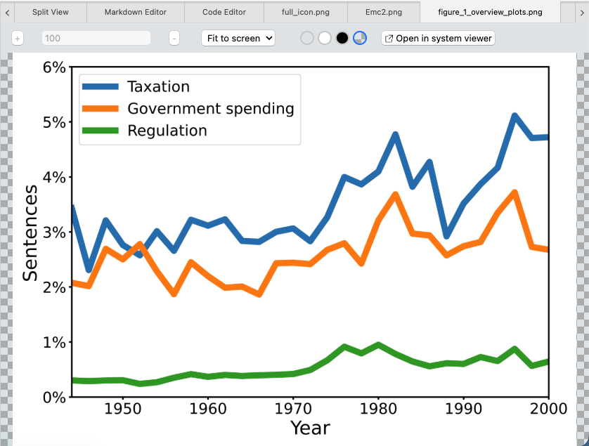
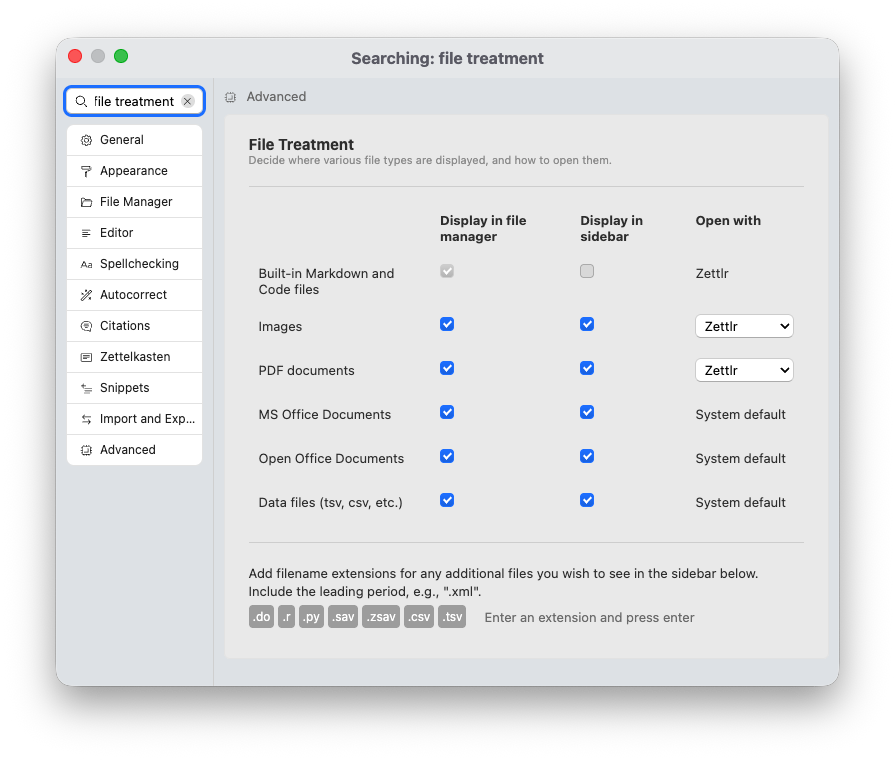

# Visualizador de imagens

O visualizador de imagens é um componente que pode carregar e mostrar imagens dentro do Zettlr. Este recurso permite, por exemplo, fazer referência a gráficos ou outras imagens enquanto você escreve.

Zettlr suporta a maioria dos tipos de imagens por padrão, incluindo imagens JPEG e PNG.

**Observação:**

    Para habilitar o visualizador de imagens, você precisa escolher "Zettlr" como o aplicativo para abrir as imagens nas preferências.

## Habilitando o Visualizador de Imagens

Zettlr usa o visualizador de imagens para exibir imagens, mas somente se você tiver definido o Zettlr como seu aplicativo para abrir imagens.

Para permitir que o Zettlr abra imagens para você, acesse a janela Preferências → “Avançado” → “Tratamento de arquivo”. Nesta seção você pode ajustar várias opções relativas a onde e como abrir vários tipos de arquivo. Certifique-se de que **Abrir com** para **Imagens** esteja definido como **Zettlr** e não como padrão do sistema.

## Usando o visualizador de imagens

O visualizador de imagens vem com um conjunto de opções de configuração que você pode definir para ajustar a forma como as imagens são mostradas. Ele vem com sua própria pequena barra de ferramentas para permitir isso.

Primeiro, você pode decidir se as imagens devem ser mostradas na íntegra e ajustadas ao tamanho disponível (o padrão). Você também pode escolher ajustar a largura ou a altura, o que exigirá rolagem. Por último, você também pode ampliar e reduzir livremente a imagem.

Ao selecionar a opção Zoom, você pode ajustar manualmente o nível de zoom com os controles no lado esquerdo da barra de ferramentas do visualizador de imagens.

A seguir, você pode escolher um plano de fundo para o visualizador de imagens. Você pode escolher entre **transparente**, **branco**, **preto** e **tabuleiro de xadrez**. Este último é frequentemente usado para mostrar transparência em imagens PNG.

Finalmente, o visualizador de imagens é apenas isso: um visualizador. Se precisar abrir a imagem no visualizador do sistema, clique no botão correspondente.

**Dica:**

    Você também pode clicar com o botão direito na guia do documento da imagem e optar por mostrar o arquivo em seu navegador de arquivos. Dessa forma, você pode selecionar manualmente em qual software deseja abrir a imagem.