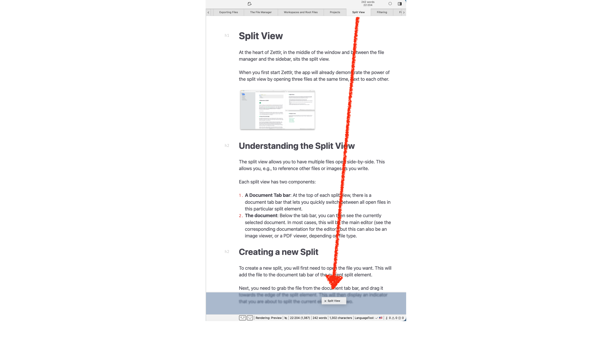
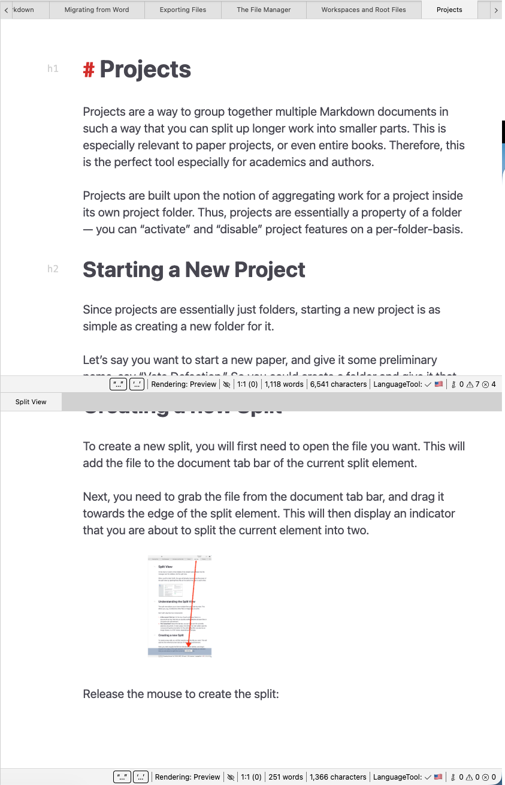

# Divisão de visualização

No coração do Zettlr, no meio da janela e entre o gerenciador de arquivos e a barra lateral, fica a visualização dividida.

Quando você inicia o Zettlr pela primeira vez, o aplicativo já demonstra o poder da visualização dividida abrindo três arquivos ao mesmo tempo, um ao lado do outro.

## Compreendendo a visualização dividida

A visualização dividida permite que você abra vários arquivos lado a lado. Isso permite, por exemplo, fazer referência a outros arquivos ou imagens enquanto você escreve.

Cada visualização dividida possui dois componentes:

1. **Uma barra de guias de documentos**: na parte superior de cada visualização dividida, há uma barra de guias de documentos que permite alternar rapidamente entre todos os arquivos abertos neste elemento dividido específico.
2. **O documento**: Abaixo da barra de guias, você pode ver o documento atualmente selecionado. Na maioria dos casos, este será o [editor Markdown principal](./markdown-editor.md) (consulte a documentação correspondente do editor), mas também pode ser um [visualizador de imagens](./image-viewer.md) ou um [visualizador de PDF](./pdf-viewer.md), dependendo do tipo de arquivo.

## Criando uma nova divisão

Para criar uma nova divisão, primeiro você precisa abrir o arquivo desejado. Isso adicionará o arquivo à barra de guias do documento do elemento dividido atual.

Em seguida, você precisa pegar o arquivo na barra de guias do documento e arrastá-lo em direção à borda do elemento dividido. Isso exibirá um indicador de que você está prestes a dividir o elemento atual em dois.

Solte o mouse para criar a divisão:

Agora você dividiu o elemento existente em dois. Observe que ambas as divisões têm sua própria barra de guias de documentos, com a divisão inferior mostrando apenas um único documento – aquele que você usou para criar a divisão.

## Movendo documentos

Para mover documentos entre divisões existentes, basta arrastá-los e soltá-los das barras da guia do documento no centro da divisão de destino. Se você não vir um indicador azul, isso significa que você não criará uma nova divisão, mas sim moverá o documento para lá.

Você também pode arrastar os documentos exatamente para a barra da guia do documento da divisão de destino, o que fornecerá um indicador, mas isso não é necessário.

## Removendo visualizações divididas

Zettlr não permite visualizações divididas vazias; para remover uma visualização dividida, você pode simplesmente mover todos os documentos para fora da visualização dividida que deseja remover. Depois que o último arquivo for removido do elemento, o Zettlr irá fechá-lo.

Para fechar um elemento dividido com vários documentos abertos, você também pode clicar com o botão direito em um local vazio na barra de guias do documento e selecionar “Fechar folha”.

**Observação:**

    Como a visualização dividida é mais um conceito para organizar documentos e menos uma “coisa” específica, os termos podem ficar confusos.
    
    O que chamamos de "Visualização dividida" geralmente significa a totalidade de todos os elementos divididos. Você também pode chamar elementos divididos individuais de "painéis", já que é assim que os chamamos internamente.

## Redimensionando visualizações divididas

Todas as visualizações divididas podem ser redimensionadas individualmente. Para fazer isso, mova o mouse sobre a borda entre dois elementos divididos. O cursor do mouse mudará de forma para indicar a direção da divisão (horizontal ou vertical). Arraste a borda para redimensionar a visualização dividida.