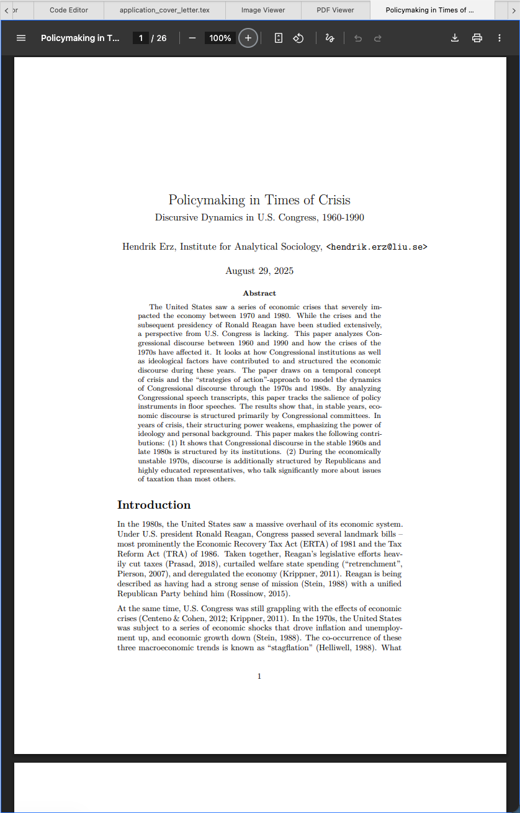

# Visualizador de PDF

O visualizador de PDF é um componente que pode carregar e mostrar arquivos PDF dentro do Zettlr. Este recurso permite, por exemplo, fazer referência a artigos ou projetos de papel exportados enquanto você escreve.

**Observação:**

    Para ativar o visualizador de PDF, você precisa escolher "Zettlr" como o aplicativo para abrir arquivos PDF nas preferências.

## Habilitando o visualizador de PDF

O Zettlr usa o visualizador de PDF para exibir arquivos PDF, mas somente se você tiver definido o Zettlr como seu aplicativo para abrir arquivos PDF.

Para permitir que o Zettlr abra arquivos PDF para você, acesse a janela Preferências → “Avançado” → “Tratamento de arquivo”. Nesta seção você pode ajustar várias opções relativas a onde e como abrir vários tipos de arquivo. Certifique-se de que **Abrir com** para **documentos PDF** esteja definido como **Zettlr** e não como Padrão do sistema.

## Usando o visualizador de PDF

Se você já usou o Google Chrome (ou um navegador derivado), reconhecerá imediatamente o visualizador de PDF. Como o Zettlr é baseado no navegador Chromium, ele contém o mesmo visualizador de PDF. Tudo o que você sabe do visualizador de PDF do Chrome se aplica ao Zettlr.

**No entanto**, há um ponto importante: como o visualizador de PDF precisa de muita interação do mouse, por padrão o visualizador de PDF está **desativado**. Para navegar em um arquivo PDF, primeiro você precisa focar o visualizador de PDF. Você faz isso simplesmente clicando dentro do documento. Então você pode usar o visualizador normalmente.

**Dica:**

    Quando um visualizador de PDF está ativo, você pode ver uma borda colorida ao seu redor. Clique fora do visualizador de PDF para desfocá-lo.