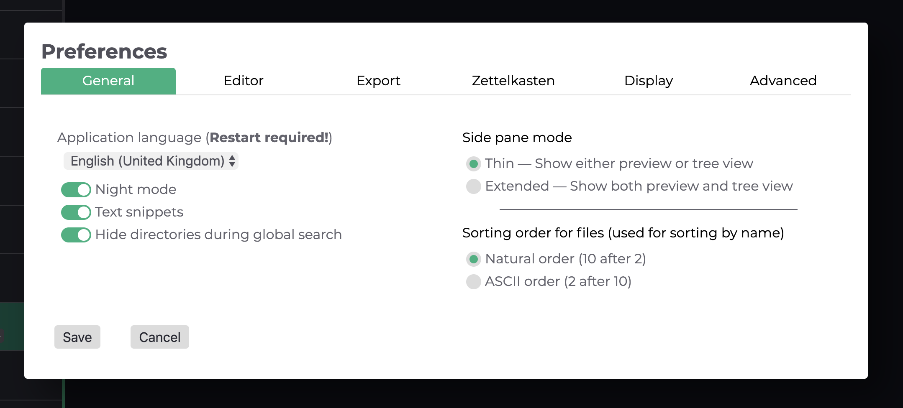
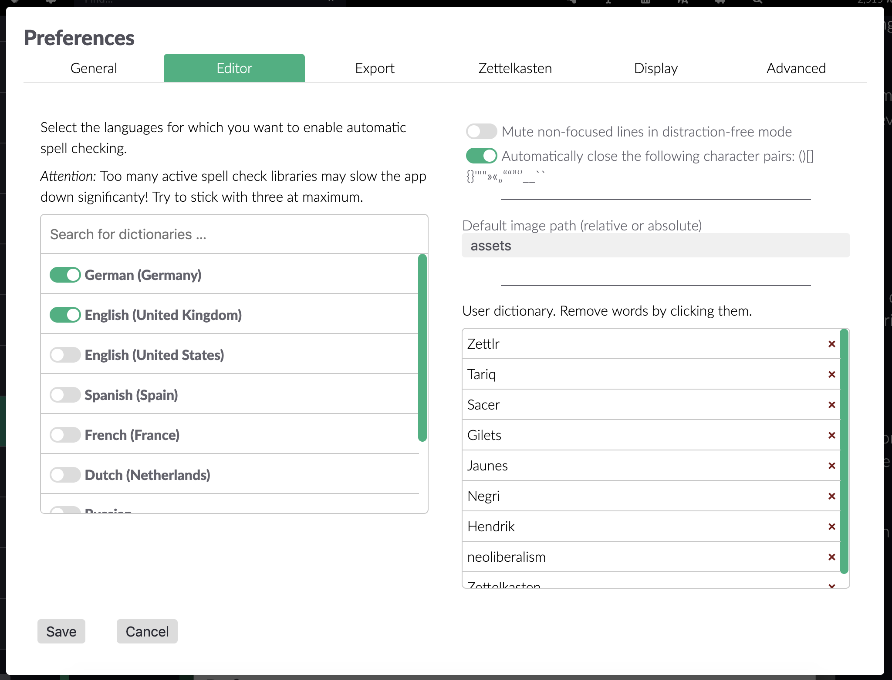
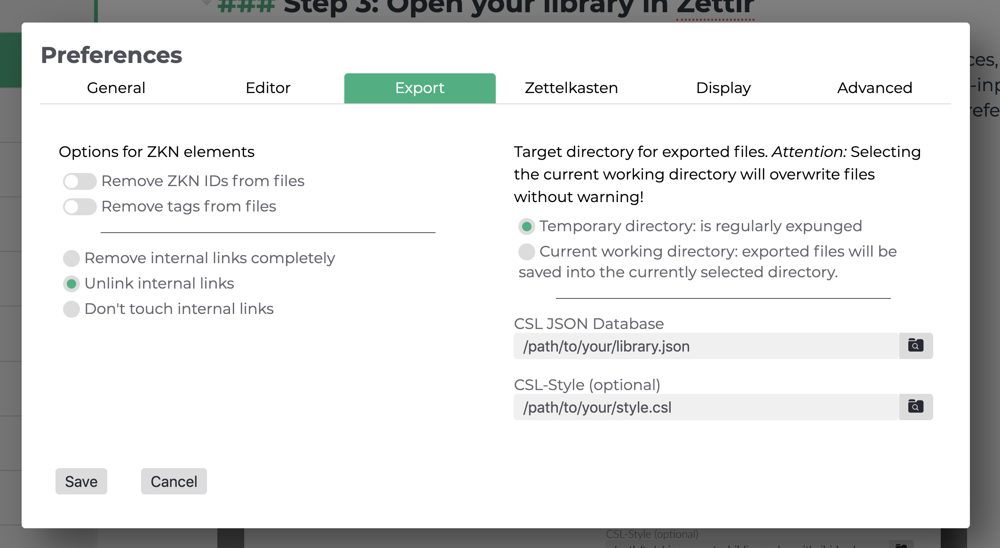
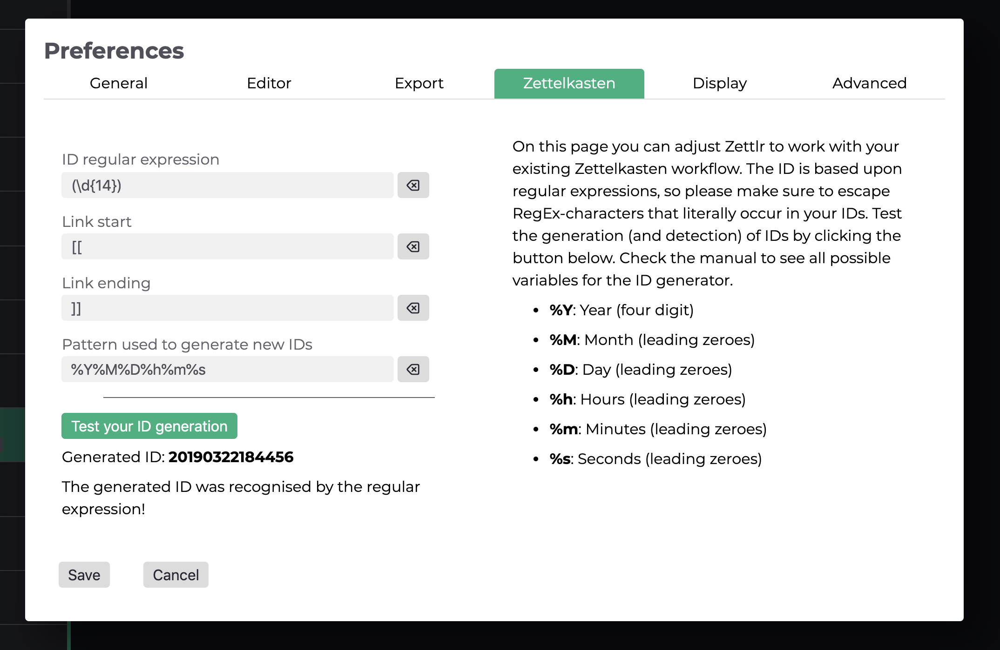
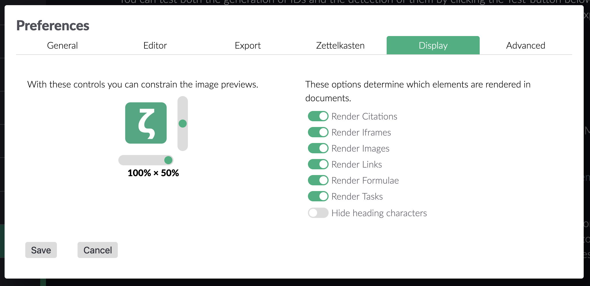
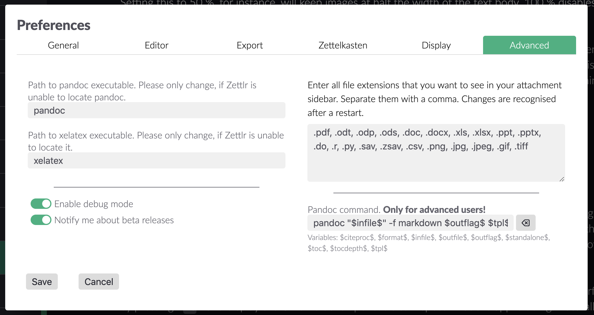

# Ajustes

Zettlr te ofrece una gran cantidad de opciones para personalizar tu experiencia con la aplicación. Viene con tres configuraciones diferentes: diálogos que se explicarán en detalle aquí, para que sepas qué opción hace qué.

## Preferencias generales

Puedes mostrar el diálogo de preferencias generales utilizando el acceso directo `Cmd/Ctrl+,`, el botón de la barra de herramientas (el piñón) o el elemento de menú correspondiente. El diálogo aparecerá y te presentará todas las opciones de configuración que puedes personalizar. Están ordenadas en seis pestañas que puedes ver en la parte superior del cuadro de diálogo.

* General: Estas opciones afectan a Zettlr en su totalidad.
* Editor: Estos ajuntes sólo afectan al propio editor.
* Exportación: Controla cómo se exportan tus archivos en esta pestaña.
* Zettelkasten (fichero): Adapta Zettlr a tu sistema Zettelkasten.
* Pantalla: Controla cómo el editor muestra ciertos elementos, como imágenes o enlaces.
* Avanzado: Opciones para usuarios experimentados.

#### General

En la pestaña general encontrarás opciones que puede que deseas ajustar si comienzas a utilizar Zettlr para adaptarlo a sus necesidades. El lenguaje de la aplicación es bastante auto-explicativo.

Las casillas "Modo Nocturno" y "Metadatos de archivos" controlan la pantalla. El "Modo Nocturno" es simplemente el tema oscuro del que Zettlr es capaz (y que puedes controlar usando el atajo `Cmd/Ctrl+Alt+L` en su lugar). Comprueba la casilla "Metadatos de archivos" para mostrar información meta en el panel de vista previa (aunque también puedes controlar este comportamiento utilizando el acceso directo `Cmd/Ctrl+Alt+S`).

Si seleccionas "Ocultar carpetas durante la búsqueda global", Zettlr no mostrará las carpetas mientras realiza una búsqueda.

El modo de barra lateral controla cómo se muestra dicha barra. Tienes dos opciones:

* Delgado: En el modo delgado, la barra lateral sólo muestra _o_ la lista de archivos _o_ la vista de árbol. Puedes cambiar entre ambos usando el atajo `Cmd/Ctrl+Mayús+1`.
* Expandido: El modo expandido muestra tanto la vista de árbol como la lista de archivos uno al lado del otro. En este modo, ambas listas están siempre presentes.

Si deseas ocultar completamente la barra lateral, utiliza el modo sin distracciones (`Cmd/Ctrl+J`).

El orden de clasificación determina cómo Zettlr ordenará tus archivos internamente. Se recomienda el orden natural; ASCII ignora ciertas implicaciones del lenguaje natural.

Por último, pero por ello no menos importante, Zettlr puede cambiar automáticamente a modo claro u oscuro dependiendo de su sistema operativo:

** **Apagado**: cambiar entre los modos manualmente
* **Horario**: Zettlr entrará y saldrá del modo oscuro entre el período de tiempo dado (formato de 24 horas)
* Siga el sistema operativo**: En macOS y Windows, Zettlr puede observar los eventos del sistema operativo notificando a las aplicaciones que se están ejecutando actualmente que el modo general ha cambiado.

### Editor

La pestaña editor controla la mayoría de las funciones del editor. La lista a la izquierda contiene todos los diccionarios disponibles que se pueden usar para revisar la ortografía. Simplemente selecciona los que deseas utilizar. Puedes utilizar varios diccionarios ala vez para comprobar textos bilingües. Filtra la lista utilizando el cuadro de búsqueda en la parte superior de la lista.

> Una pista: Para desactivar la corrección ortográfica, desmarca todos los diccionarios. Para instalar diccionarios adicionales, consulta el [manual de localización](../core/localisation-es.md).

En el lado derecho de la pestaña, puedes ver algunas casillas de verificación, una entrada de texto e otra lista. En primer lugar, puedes **oscurecer las líneas no enfocadas** mientras estás en el modo libre de distracción. Esto significa que Zettlr atenúa todas las líneas excepto aquella en la que se encuentra el cursor. La siguiente opción te permite **cerrar automáticamente ciertos pares de caracteres**.

La **ruta de imagen predeterminada** es una ruta que puedes utilizar para indicar a Zettlr dónde debe colocar tus imágenes cuando las pegues desde el portapapeles. Puede ser absoluta o relativa. Si proporcionas el nombre "recursos", Zettlr pondría las imágenes por defecto en la sub-carpeta "recursos" del directorio donde se encuentra tu archivo. Incluso puedes decirle que use una carpeta relativa al directorio padre, por ejemplo, `../recursos`. Recuerda que siempre puedes seleccionar la carpeta para una imagen caso por caso.

Finalmente, la lista a la derecha de la pestaña muestra todas las palabras que has añadido a tu diccionario personalizado. Haz clic en ellos para eliminarlos del diccionario del usuario.

### Exportar

La pestaña de exportación te permite ajustar todas las preferencias relativas a la forma en que se exportan tus archivos. A la izquierda tienes opciones sobre la funcionalidad de Zettelkasten (fichero).

Seleccionando "Eliminar los ID de ZKN (Zettelkasten; fichero) de los archivos" hace que Zettlr elimine todos los ID que encuentre en tus archivos antes de la exportación. "Eliminar etiquetas de los archivos" hace lo mismo, pero con etiquetas.

> Te recomendamos que dejas desactivada la opción de eliminar los identificadores de Zettelkasten de tus archivos, a menos que sepas lo que está haciendo. Algunos sitios web producen enlaces que contienen 14 dígitos consecutivos, y Zettlr sólo caminará a través de los archivos eliminando todo lo que la expresión regular de tu ID detecte, ¡así que puede romper los enlaces!

Debajo de estas opciones puedes elegir qué hacer con los enlaces internos (por defecto están encapsulados en `[[` y `]]`). La primera opción los elimina por completo, la segunda sólo elimina el formato del enlace, mientras que la última opción los deja en paz.

En el lado derecho tienes opciones más generales para exportar. Puedes elegir exportar tus archivos al directorio temporal. Esto es recomendable, ya que te permite dejar los archivos en paz, ya que se eliminarán automáticamente. La segunda opción almacena los archivos renderizados en el directorio actual, sobrescribiendo los archivos existentes sin preguntar. Utiliza esta opción si necesitas que los archivos estén presentes en la barra lateral de archivos adjuntos.

El cuadro de base de datos CSL JSON se puede utilizar para abrir una base de datos de literatura. Zettlr leerá en el archivo y habilitará la representación de citas en tus archivos. El Estilo CSL te permite sobrescribir el estilo de citación predeterminado (APA). Puedes utilizar cualquier archivo presente en el repositorio[Zotero style repository (Repositorio de Estilo de Zotero)](https://www.zotero.org/styles).

> Las opciones de citación pueden sobrescribirse para cada proyecto en la configuración del proyecto correspondiente.

### Zettelkasten (fichero)

En esta pestaña puedes personalizar el funcionamiento de Zettlr con tu sistema Zettelkasten existente. En la mayoría de los casos no tendrás que tocar estas opciones, excepto si quieres utilizar un sistema personalizado.

Tienes cuatro opciones que son importantes para Zettelkästen: La expresión regular del ID, el inicio y el final del enlace, y el generador del patrón.

#### La ID RegEx

Zettlr usa expresiones regulares internamente para filtrar la ID de un archivo. Busca ese patrón, y si encuentra una cadena que coincida con ese patrón, lo asume como la ID del archivo. **Por favor, ten en cuenta que la primera coincidencia en un archivo será asumida como la identificación, nunca la última: Si eliges utilizar sólo cuatro dígitos como ID, la expresión regular también coincidirá con años dentro de su archivo. Como Zettlr simplemente toma el primer ID, asegúrese de que la primera cosa en tu archivo es la ID de ese archivo.

La expresión regular predeterminada (que puedes restaurar pulsando el botón de reinicio junto al cuadro de texto) es `(\d{14})`. Esto significa que Zettlr buscará 14 dígitos consecutivos - exactamente el número de dígitos que obtienes cuando concatenas un año, un mes, un día, una hora, un minuto y un segundo; así: 20181012143724. Es extremadamente improbable que un archivo contenga una segunda cadena que incluya catorce (!) dígitos, por lo que es un gran método para utilizarlo como ID. Otra gran cosa es que la ID es único para el segundo. Así que cada segundo puedes crear una ID nueva y totalmente única.

Las llaves alrededor del ``d{14}` crean un llamado "grupo de captura". El propósito de un grupo de captura es que la expresión regular no sólo coincida con una determinada cadena, sino que también extraiga una parte de ella, en este caso la coincidencia completa. De esta manera puedes utilizar casi cualquier estructura de IDs que deseas.

> Ten en cuenta que puedes omitir las llaves del grupo de captura. Zettlr encapsulará tu RegEx internamente, si no hay grupo de captura.

#### Los Enlaces Internos

Los enlaces internos se explican bastante rápido: simplemente elige cómo quieres escribir los enlaces internos. Los enlaces por defecto son Wiki-Style-Links: [tu-enlace]. También puedes usar llaves: {{tu-enlace}. O puedes usar signos de exclamación: !tu-enlace!. [¡Lo que más te convenga!

Los enlaces internos se utilizan para dos cosas: En primer lugar, si contienen un nombre de archivo existente o un ID existente, al hacer clic en ellos se abrirá directamente el archivo respectivo (identificado por su nombre sin la extensión o por su ID). Segundo, si no contienen nada de eso, no abrirán ningún archivo, pero funcionarán como una función de búsqueda, así que `ALT`-clic en ellos iniciará una búsqueda - ¡esto es genial para guardar las búsquedas que haces a menudo!

> Ten en cuenta que los archivos no asumirán ningún enlace como ID. Si un archivo encuentra un ID que está rodeado por el formato de enlace interno, no utilizará este ID.

#### El generador de ID

La última parte de la pestaña Zettelkasten en la ventana de ajustes se refiere a la forma en que se generan las IDs. Es una simple cadena que puede contener variables que son reemplazadas cuando se genera una ID. Actualmente, tienes disponible el año, mes, día, hora, minuto y segundo actual. El patrón predeterminado del generador de ID es: `%Y%M%D%h%m%m%s`, lo que significa que reemplazará `%Y` con el año actual (4 dígitos), `%M` con el mes actual (con ceros a la izquierda), y así sucesivamente. También puedes incluir alguna parte estática en tus identificaciones, si lo deseas. Así que con el patrón de identificación establecido en `%Y-%M-%D_%h:%m:%s` Zettlr generaría una identificación como ésta: `2018-10-12_12:03:56`. También puedes reutilizar las variables de tu patrón, por ejemplo, para usar sólo segundos como identificación. Podrías usar algo como esto: `%s%s%s` y obtendrías 56565656.

Recuerda siempre adaptar tu expresión regular para que coincida con lo que escupe el generador de ID. Para identificar con éxito la ID con el patrón, `%Y-%M-%D_%h:%m:%m:%s`, Zettlr necesitaría la siguiente expresión regular: `(\d{4}-{d{2}-{d{d{2}_d{d{2}:\d{2}:\d{2}).`

Puedes probar tanto la generación de IDs como la detección de los mismos haciendo clic en el botón Probar situado debajo de los cuadro de texto. Zettlr generará entonces una ID e inmediatamente intentará coincidir con ella usando tu expresión regular personalizada. Se indicará si Zettlr fue capaz de detectar el ID.

### Visualización

Esta pestaña controla cómo el editor muestra ciertos elementos. Zettlr utiliza un enfoque de semi-muestra para Markdown y sólo muestra algunos elementos. En esta pestaña puedes controlar qué elementos se renderizarán.

> La configuración de iFrame controla si se renderizan o no los iFrames (por ejemplo, los vídeos de YouTube son iFrames embebidos).

Además, puede limitar el tamaño de las imágenes, lo que es especialmente beneficioso si utilizas muchas imágenes orientadas al retrato. El control deslizante horizontal controla la cantidad máxima de imágenes de ancho que se pueden ocupar. Por ejemplo, si lo ajustas al 50%, las imágenes se mantendrán a la mitad del ancho del cuerpo del texto. El 100% desactiva esta reducción (las imágenes nunca serán más anchas que el 100% del ancho del cuerpo del texto).

El control deslizante vertical controla la altura máxima de las imágenes en relación con el tamaño de la ventana. El 50 por ciento significaría que las imágenes nunca serán más grandes que la mitad del tamaño total de la ventana. El 100 por ciento desactiva este comportamiento. A diferencia de la anchura, las imágenes pueden superar el 100 por ciento de la vista si son grandes y delgadas.

### Avanzado

La pestaña avanzada contiene opciones que son útiles para los usuarios avanzados.

Los cuadros **Pandoc** y **XeLaTex-text** se utilizan en caso de que Zettlr no pueda localizar ninguno de estos dos programas. Como sabes, Zettlr usa ambos para exportar tus archivos. En raras ocasiones puede ser que Zettlr no pueda encontrarlos, aunque los hayas instalado correctamente. Si eso sucede, simplemente introduce la ruta **completa y absoluta** a ambos programas en los campos de texto para ayudar a Zettlr a encontrarlos.

La opción **debug** se utiliza para controlar si Zettlr te deja o no de "recargar" la interfaz gráfica de usuario (GUI) pulsando `F5` y mostrar las herramientas de desarrollo de Chrome para inspeccionar lo que está haciendo la aplicación. Naturalmente, querrías hacer esto como desarrollador.

También puedes ayudar a Zettlr por **suscribirte a las versiones beta**. Cuando marcas esta opción, Zettlr también te notificará sobre nuevas versiones beta. A continuación, puedes decidir si deseas utilizar la versión beta o no.

El área de texto a la derecha controla qué archivos se mostrarán en la barra lateral **adjunto**. Es simplemente una lista separada por comas de todas las extensiones de archivo que te gustaría tener a su disposición. La lista inicial ya debería contener la mayoría de las extensiones que pueda estar utilizando.

El comando **Pandoc** te da control total sobre el motor de exportación. El comando de allí se ejecutará en la exportación. Dispones de algunas variables para personalizar tu exportación:

- "$infile$": La ruta completa y absoluta al archivo que se va a exportar.
- `$outfile$`: La ruta completa y absoluta al archivo resultante (incluyendo la extensión correcta).
- `$citeproc$`: Contiene directivas para el motor `pandoc-citeproc`.
- `$formato$`: Contiene el formato (por ejemplo, `html` o `docx`).
- `$outflag$`: El indicador de formato para el Pandoc (por ejemplo, `-t docx`).
- `$standalone$`: Será `-s` en caso de que el archivo necesite ser exportado de forma independiente.
- "$toc$": Si se generará o no un índice de contenidos.
- "$tocdepth$": Un indicador que indica el nivel hasta el cual se debe generar un índice de contenido.
- "$tpl$": Una directiva modelo para Pandoc.

> **Atención**: Muchas de estas variables se adaptan a las necesidades de Pandoc. Por supuesto, puedes cambiar completamente el programa reemplazando `pandoc` por el nombre de tu motor de exportación deseado, pero por favor ten en cuenta que necesitarás saber cómo analizar las flags de Pandoc.

'# Preferencias PDF

Hemos movido las Preferencias de PDF a otro cuadro de diálogo porque hay muchos que puedes usar. Estas opciones controlan cómo el motor LaTeX renderizará tus archivos en la exportación de PDF. No tienen ningún efecto sobre todos los demás formatos de exportación. Puedes abrir el diálogo usando su acceso directo `Cmd/Ctrl+Alt+,` o usando la entrada de menú respectiva. Las opciones de PDF también están divididas por tabulaciones. Actualmente, hay tres:

* Metadatos: Esto controla el campo de metadatos de los archivos PDF.
*Página: Ajusta la disposición de las páginas utilizando esta pestaña.
* Fuente: Todas las opciones relativas a la fuente utilizada en tus exportaciones se recopilan en esta ficha.

### Metadatos

Estos datos se pueden mostrar en tus lectores de PDF mediante un elemento de menú dedicado. Normalmente se ocultan a la vista, pero en algunas circunstancias se utilizan. Lo único que realmente debería preocuparte es el cuadro del autor, que se rellena con la información "Generado por Zettlr". Puedes cambiar esto por tu propio nombre (o el nombre de tu empresa). Las palabras clave y el campo "tema" se utilizan muy poco.

### Página

En esta pestaña puedes controlar la disposición de la página. Estas opciones funcionan tal y como se espera de los diálogos similares que se utilizan en LibreOffice o Microsoft Office. Puedes cambiar el tamaño del papel, ajustar los márgenes alrededor del contenido y decirle a Zettlr si quieres o no utilizar números de página (y qué sistema de numeración desea utilizar).

### Fuente

Aquí puedes controlar cómo se muestra la fuente. La fuente principal es la fuente utilizada para todo el texto. El motor LaTeX lo obtendrá directamente, así que el nombre que escribes aquí debe coincidir exactamente con una fuente instalada en tu ordenador. **Si el motor LaTeX no puede localizar la fuente, se producirá un error. Para saber si ha encontrado un error de este tipo u otro error que no se relacione con la fuente, simplemente busque el nombre de la fuente que escribió aquí en el mensaje de error. Si aparece el nombre de la fuente, es muy probable que se llame de forma diferente. A continuación, abre las preferencias de fuente de tu sistema operativo y comprueba el nombre.

Lo que es el tamaño de la fuente debe ser bastante obvio. La altura de la línea especifica el espacio entre líneas (esto sólo se aplica a los párrafos). Por ejemplo, una altura de línea de 150 por ciento crearía un espacio de media línea entre las líneas (es decir, cada línea es seguida por un espacio de 50 por ciento de una altura de línea normal antes de que comience la siguiente línea).

## Administrar Tags (etiquetas)

El cuadro de diálogo de etiquetas no tiene un acceso directo asociado, por lo que tendrá que llamarlo utilizando el elemento de menú correspondiente. Aquí puedes asignar colores y descripciones a las etiquetas.

Para añadir una nueva relación de color de la etiqueta, simplemente pulse el botón `+` en la parte inferior del diálogo. En el primer campo, introduce tu etiqueta sin el símbolo almohadilla delante (por ejemplo, si quieres asignar un color al tag `#todo`, simplemente introduce `todo`). A continuación, elige un color para asignar a esa etiqueta. Si haces clic en la segunda barra después del campo de nombre de la etiqueta, aparecerá un selector de color que te permitirá elegir un color. En el tercer campo, puedes introducir una descripción breve para esa etiqueta. Esta descripción se mostrará si pasas el ratón por encima de los símbolos de las etiquetas en el panel de vista previa.

Si desea eliminar una asociación de color de la etiqueta, simplemente haz clic en el botón `-` al final de la frase de la etiqueta.
