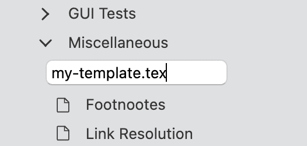
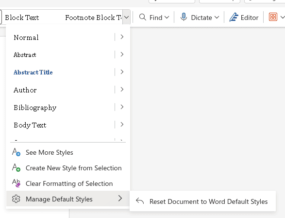
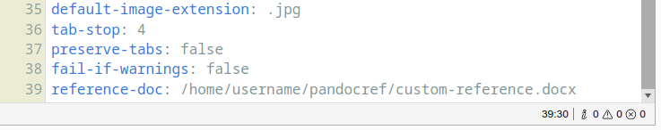

# Custom Templates and Reference Documents

When you are done with the content of your paper, it is time to turn your attention to its aesthetics. Your ideas are valuable. However, to truly make them shine, you have to select the right layout and typography. For example, you may want to use a specific font, a different line spacing and maybe even colour. If you are so inclined, you can make truly amazing looking documents, [like these examples](https://tex.stackexchange.com/questions/1319/showcase-of-beautiful-typography-done-in-tex-friends).

In addition to giving you the freedom to use tools like Pandoc and LaTeX, a core principle of Zettlr's philosophy is to makes these tools work _well_ for you. This page will introduce you to using the two types of custom templates that Zettlr supports: templates and reference documents.

## About Custom Templates and Reference Documents

When you export any file to, say, Microsoft Word, PDF, or HTML, you need to add layouting and styling to them. If you simply start an export from within Zettlr, it will automatically add a default layout and styling to the document. Every export format has one of these default layouts. These work well out of the box, but this page describes how you can customize them. This documentation section is also relevant when you want to apply a conference or journal LaTeX template, since it follows the same process (except that you already have a template source which you only need to make work with Pandoc, Zettlr's export engine).

All of the following therefore comes from the Pandoc documentation on how templating works, but adapted to how you will interact with templates and reference documents from within Zettlr.

That being said, Pandoc knows two types of layouts: templates and reference documents.

A **template** is any plain text source file that contains styling and layouting directives, and some template directives. Pandoc will take such a template, convert your file to the correct target syntax, embed it in the template, and write the entire file to disk. To see what such a template looks like, you can [scroll through Pandoc's template directory](https://github.com/jgm/pandoc/tree/main/data/templates).

However, there are some document formats that do not work so well with Pandoc's templating approach, among them Word and OpenOffice documents. Pandoc calls them **reference documents**. A reference document works slightly different from templates. A template lets you directly specify where you want which content from your Markdown file, a reference document does not. Instead, a reference document specifies some layouting and styling rules, which Pandoc will copy over to a new document that forms the actual file that you will export.

In the following sections, we first describe the basic principles of templating, Pandoc's template syntax, and finally how reference documents work. We will use LaTeX as an example for how templating works, but the same principles apply to all other templates, such as HTML.

## Getting Started with Templating

Let's write your first LaTeX template, which can be done directly in Zettlr. When complete, your template file will be passed to Zettlr, Citeproc (if applicable), Pandoc, and then finally LaTeX. 

First, create a new TeX file (File -> New File, or by right-clicking some folder). Ensure to use the filename extension `.tex`. Start writing your LaTeX template and then save your file (File -> Save).



Zettlr will automatically switch code highlighting from Markdown to LaTeX, and a small `TeX` indicator will appear beneath the filename in the file list.


## Pandoc Templating Basics

You can use a lot of different variables in Pandoc templates, depending on your needs. The default templates of Pandoc already contain many useful variables which are documented there. However, you are free to not use variables which you deem not important, and you can even introduce your own variables using Pandoc's templating engine. For example, let's assume you want to add additional information to some, but not all of your exports. Then you could define a variable `my-variable` and define if in all YAML frontmatters where the exported files should contain that information:

```markdown
---
title: "My file title"
date: 2021-10-18
my-variable: "Some additional piece of information"
---
```

Inside your template, you would then need to do something with this variable:

```
$if(my-variable)$
This is some text that will only be contained if "my-variable" has been defined.

You can even insert the contents of the variable by typing $my-variable$
$endif$
```

!!! note

    Note that this is just an example. A more full-fledged example that arguably drives the principle of variables to the max, see [this template for a curriculum vitae](https://github.com/nathanlesage/cv).

While many variables are optional, there is one Pandoc variable that needs to be present at all times:

```
$body$
```

Pandoc will replace this variable with the contents of your Markdown file(s). If you leave it out, your content will not appear in the output file.

## Citations and References

If you're using Zettlr's reference manager-integration to insert dynamic references from Zotero or another app into your article, you'll need to add the following code block to the preamble of your LaTeX template:

```latex
$if(csl-refs)$
% definitions for citeproc citations
\NewDocumentCommand\citeproctext{}{}
\NewDocumentCommand\citeproc{mm}{%
\begingroup\def\citeproctext{#2}\cite{#1}\endgroup}
\makeatletter
% allow citations to break across lines
\let\@cite@ofmt\@firstofone
% avoid brackets around text for \cite:
\def\@biblabel#1{}
\def\@cite#1#2{{#1\if@tempswa , #2\fi}}
\makeatother
\newlength{\cslhangindent}
\setlength{\cslhangindent}{1.5em}
\newlength{\csllabelwidth}
\setlength{\csllabelwidth}{3em}
\newenvironment{CSLReferences}[2] % #1 hanging-indent, #2 entry-spacing
{\begin{list}{}{%
	\setlength{\itemindent}{0pt}
	\setlength{\leftmargin}{0pt}
	\setlength{\parsep}{0pt}
	% turn on hanging indent if param 1 is 1
	\ifodd #1
	\setlength{\leftmargin}{\cslhangindent}
	\setlength{\itemindent}{-1\cslhangindent}
	\fi
	% set entry spacing
	\setlength{\itemsep}{#2\baselineskip}}}
{\end{list}}
\usepackage{calc}
\newcommand{\CSLBlock}[1]{\hfill\break\parbox[t]{\linewidth}{\strut\ignorespaces#1\strut}}
\newcommand{\CSLLeftMargin}[1]{\parbox[t]{\csllabelwidth}{\strut#1\strut}}
\newcommand{\CSLRightInline}[1]{\parbox[t]{\linewidth - \csllabelwidth}{\strut#1\strut}}
\newcommand{\CSLIndent}[1]{\hspace{\cslhangindent}#1}
$endif$
```

!!! warning

    With new Pandoc updates, this code block may change. Always refer to the [current default Pandoc LaTeX template](https://github.com/jgm/pandoc/blob/main/data/templates/default.latex) if something looks off.

## Activate your template

In order to put your template to work, you must point Zettlr to it, via the PDF Defaults File in the Assets Manager. Navigate to the Assets Manager from Zettlr's Menu and select 'PDF' from the list of configurations ('Defaults Files') on the left. Next add `template: ` to the bottom of the configuration file. Note the space after the colon. Now Zettlr needs to know the path to your new template file. Locate your template file, which if you've created it in Zettlr, you may find by right-clicking on the file in Zettlr's file manager and select 'Show File'. Note that the name of the LaTeX file must end in `.tex`. Once you've found the file, you need to find it's location in your computer's directory structure – which is the file's 'path' or 'pathname'.

- On macOS, you can find the file's path by right-clicking the file in the Finder and hit the 'Option' key, which will change the 'Copy file' menu item to 'Copy as Pathname'. 
-  On Ubuntu Linux, using the File Browser, you can find the path of the currently selected file using the keystroke combo **CTRL** + **L**, which displays the file's path in the location bar.
-  On Windows 10 and 11, select the file in File Explorer and use press and hold the **Shift** on your keyboard while **Right-clicking** on it. In the context menu that pops up, select “Copy As Path.” 

Copy the pathname and paste it into the PDF Default File, e.g.: `template: "/path/to/your/template.tex"`. Surround this path with quotes, just in case.


Remember to leave a space between the colon and your pathname. Save the changes and enjoy your LaTeX template.

## Reference Documents

After having introduced templates, it is now time to introduce Pandoc's concept of **reference docs**.

### Creating a Reference Doc

If you're exporting to a format that requires a reference doc instead of a template for customization, such as Microsoft Word (`.docx`), you can do so by specifying a reference doc. This is simply an existing Word document that uses your preferred style presets (e.g., the fonts or other style attributes you've assigned to different elements, like `Title`, `Heading 1`, `Body Text`, etc.). When Zettlr exports your document to a `.docx` file, it will look to this reference doc to determine what styles to use.

If you're unsure how to define styles in your word processor, here are some handy guides for doing so in:

- [Microsoft Word](https://support.microsoft.com/en-us/office/customize-or-create-new-styles-d38d6e47-f6fc-48eb-a607-1eb120dec563)
- [Apple Pages](https://support.apple.com/guide/pages/intro-to-paragraph-styles-tanaa39b0aa3/mac)
- [LibreOffice Writer](https://help.libreoffice.org/latest/en-US/text/shared/01/styles.html?&DbPAR=SHARED&System=UNIX)
- [OnlyOffice Document Editor](https://helpcenter.onlyoffice.com/docs/userguides/document_editor/formattingpresets.aspx)
- [Google Docs](https://it.umn.edu/services-technologies/how-tos/google-docs-apply-modify-heading-styles)

If your word processor saves to the cloud—or if it saves by default in a format other than `.docx`—remember that once you've defined your styles you will need to export/save a _local_ copy of your document in `.docx` format.

### Customizing Pandoc's Default Reference Doc

The content of your reference doc does not matter, so long as it contains examples of the styles you're going to be using in the documents you author in Zettlr. If you need a place to start, though, you can begin by using Pandoc's custom reference doc. Pandoc allows you to export its reference doc (see below). This reference doc contains a sampling of the different text elements—headings, body text, captions, etc.—that Zettlr can export. Open the document in Microsoft Word or your favorite word processor, reformat each element as you see fit, and update the document styles accordingly. Remember to save the document as a `.docx` file when you're done.

To export a custom reference doc for any of the available formats, you can run the following command:

```bash
# Export the Word reference doc
pandoc -o custom-reference.docx --print-default-data-file reference.docx
# Export the OpenOffice/LibreOffice reference doc
pandoc -o custom-reference.odt --print-default-data-file reference.odt
# Export the PowerPoint reference doc
pandoc -o custom-reference.pptx --print-default-data-file reference.pptx
```

Afterwards, you can open these files and adapt the styles as explained above.

!!! tip

    If you're using Microsoft Word as your word processor and you would like to export using Word's default style sheet, you can open the `custom-reference.docx` file in Word and select the down-pointing chevron (⌄) that appears next to the style palette. This will spawn a dropdown menu that includes a submenu titled "Manage Default Styles." Navigate to this submenu and choose "Reset Document to Word Default Styles." This will apply all of Microsoft Word's default styles to your reference doc.



### Creating a Custom Export Profile

Once you've created and saved your reference doc (or decided on an existing `docx` file that you'd like to use for this purpose), you'll need to point Zettlr to it. In Zettlr, open the Assets Manager (`File > Preferences… > Assets Manager`). Under the `Exporting` tab, you'll see a `Microsoft Word` export profile. This export profile is protected, meaning it's a mission-critical settings file that cannot be modified. However, you can view its contents and copy them over to your own custom export profile, which is what we're going to do.

Create a new export profile using the `+` button at the bottom left of the `Exporting` panel. Copy the contents of the default `Microsoft Word` export profile to your new custom profile. Beneath the last line of the pasted settings, add a new line specifying the location of your reference doc, like so:

```yaml
reference-doc: /path/to/your/custom-reference.docx
```

Here's what that looks like in the UI:



After you've added the final line, save the custom profile you've just created/modified. Then rename it to something you'll remember (e.g., `Custom Word Export`).

### A Note to Windows Users

Windows users need to make sure of two things. First, be sure to use forward slashes (`/`) rather than backslashes (`\`) when specifying the location of your reference doc. Windows users should also place the file location in quotes, like so:

```yaml
reference-doc: "C:/Users/user/Documents/Custom Templates/custom-reference.docx"
```

### Exporting

To export a Zettlr file using your custom Word styles, simply choose the custom export profile you created from the export menu.

## Final Thoughts

Zettlr strives to give you full command over what you can do with your files. What we've outlined on this page is only the start. How do you use Zettlr's possibilities to do weird things? Tell us on [BlueSky]([https://www.twitter.com/Zettlr](https://bsky.app/profile/zettlr.com)), [Discord](https://go.zettlr.com/discord), or on [Reddit](https://www.reddit.com/r/Zettlr)!
