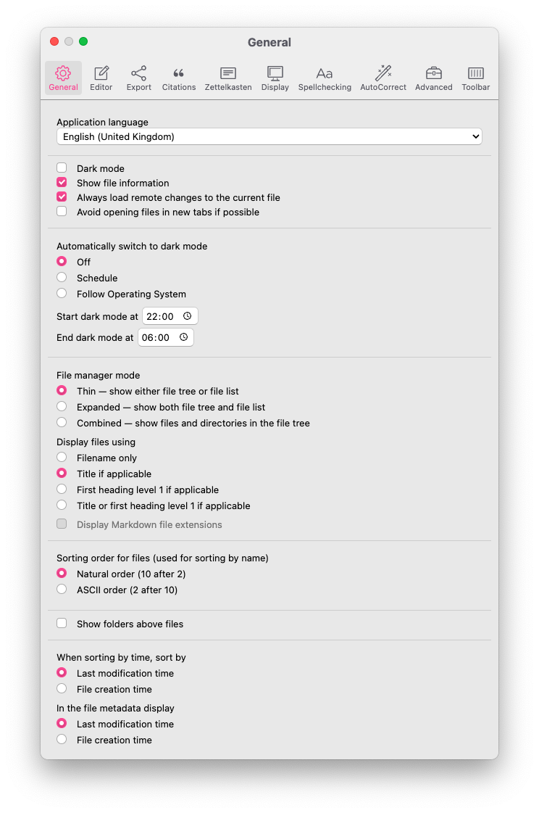
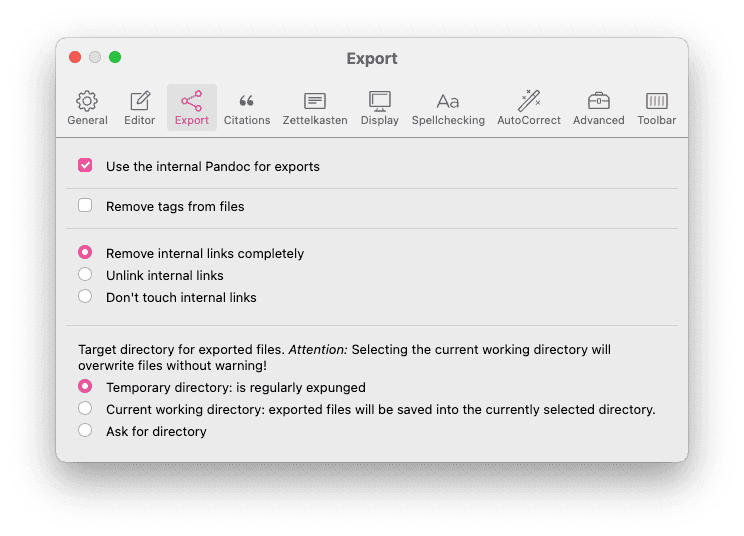
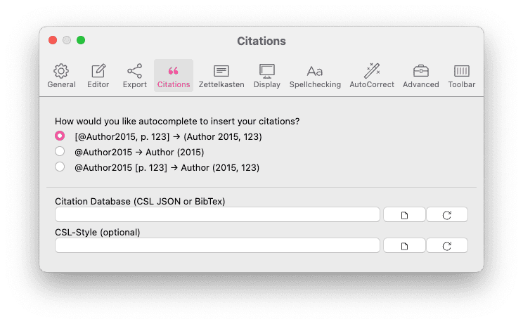
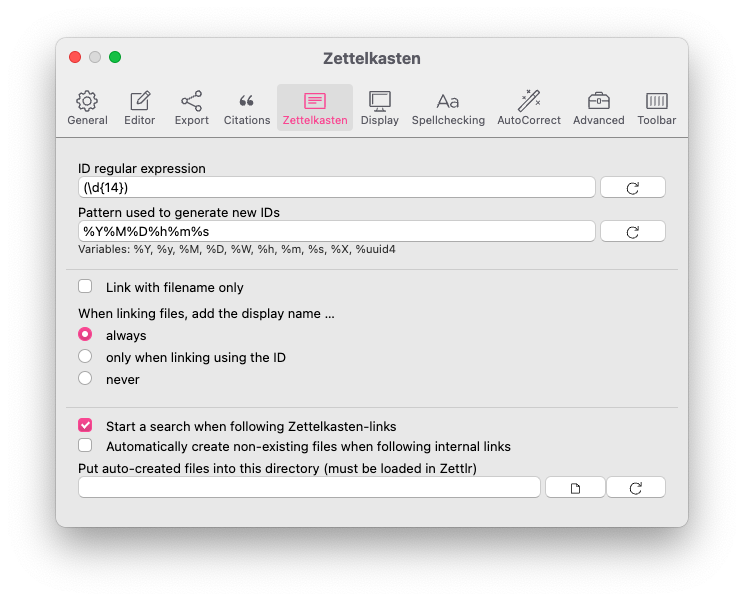
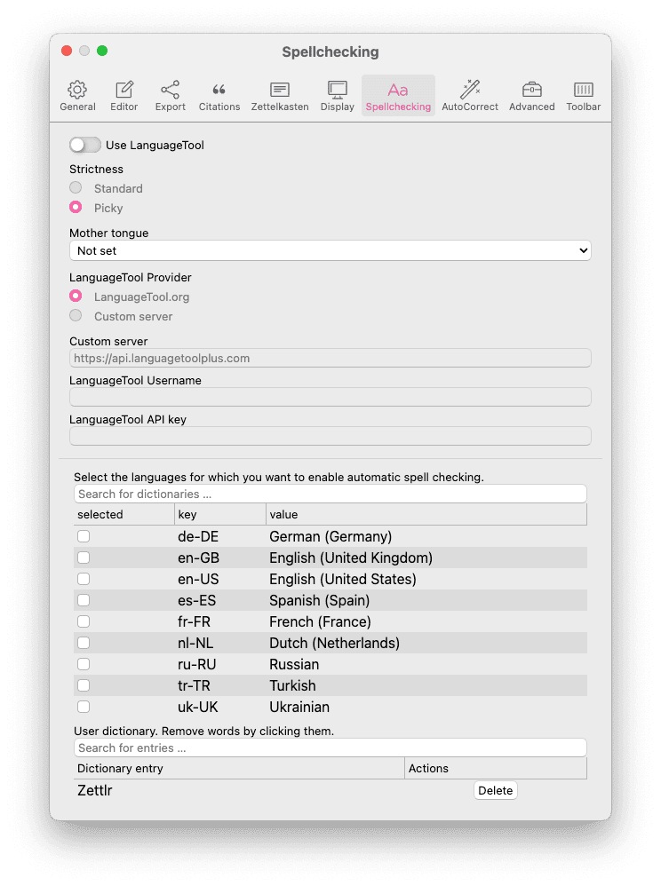
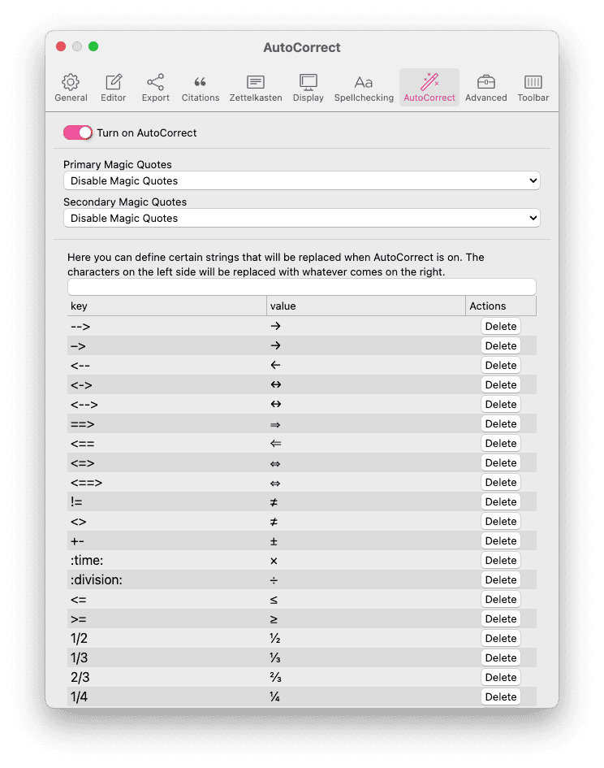
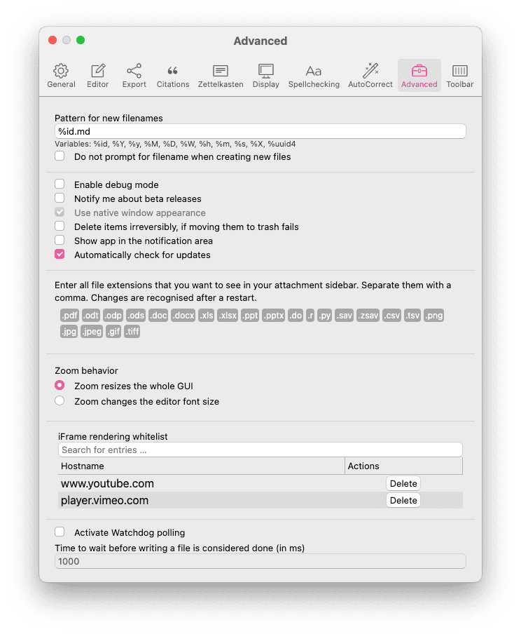
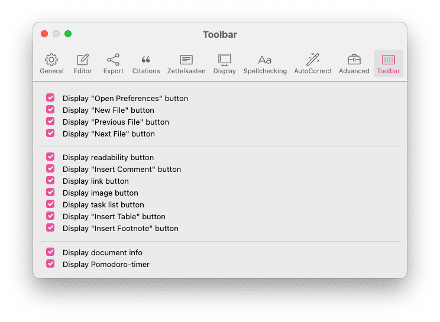
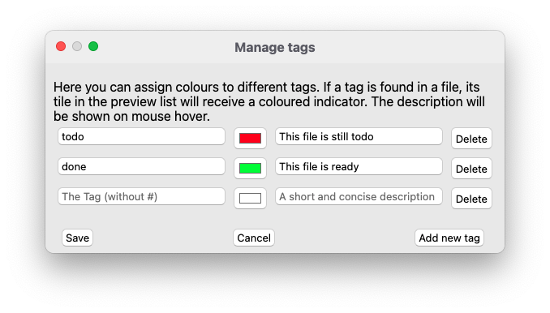

# Настройки

Zettlr offers you a plethora of options to customise your experience with the app. It comes with three major settings dialogs, one of which is the [assets manager explained elsewhere](../advanced/assets-manager.md), a general preferences dialog, and a tag manager.

## General Preferences

You can display the general preference dialog using either the shortcut <kbd>Cmd/Ctrl</kbd>+<kbd>,</kbd>, the toolbar button (the cog) or the respective menu item. The dialog will then show up and present to you all configuration options you may customise. They are ordered in ten tabs that you can see at the top of the dialog.

* [General](#general): These options affect Zettlr as a whole
* [Editor](#editor): These settings concern only the editor itself
* [Export](#export): Control how your files are exported in this tab
* [Citations](#citations): Control how to cite within Zettlr
* [Zettelkasten](#zettelkasten): Adapt Zettlr to match your Zettelkasten system
* [Display](#display): Control anything display-related
* [Spellchecking](#spellchecking): Spellchecking and LanguageTool live here
* [AutoCorrect](#autocorrect): AutoCorrect and MagicQuotes settings
* [Advanced](#advanced): Options for experienced users
* [Toolbar](#toolbar): Customize the toolbar buttons

### General

In the general tab you find options that you might want to adjust if you begin using Zettlr to fit it to your general needs.

Application language

: Sets the language the application will be displayed in. Your changes are applied after a restart. Note that not all translations are complete, so you may see English strings in some places. If you want to improve a translation, [here we explain how](../getting-started/get-involved.md#translating-the-app).

Dark mode

: Whether the application uses dark or light colors. Usually automatically applied depending on your settings on "Automatically switch to dark mode" (see below). Can also be triggered using <kbd>Cmd</kbd>/<kbd>Ctrl</kbd>+<kbd>Alt</kbd>+<kbd>L</kbd>.

Show file information

: Controls whether the file *list* (available in thin and expanded file manager modes) shows some meta information about your files, such as tags, or writing targets.

Always load remote changes to the current file

: If checked, Zettlr will silently reload any remote changes to your files. If unchecked, you will be asked whether you want to load remote changes for each file individually.

Avoid opening files in new tabs if possible

: By default, Zettlr will open each file in its own tab. Selecting this will make Zettlr attempt to exchange tabs if possible.

Automatically switch to dark mode

: **Off**: Zettlr will never change the dark mode setting automatically>

: **Schedule**: Zettlr will switch to and from dark mode at the times specified in "Start/End dark mode at …"

: **Follow Operating System**: Follow your operating system's dark mode setting (not available on Linux).

Start dark mode at

: Specifies a time (format: HH:MM) at which Zettlr will once automatically switch from light mode to dark mode if applicable.

End dark mode at

: Specifies a time (format: HH:MM) at which Zettlr will once automatically switch from dark mode to light mode if applicable.

File manager mode

: Controls how the file manager in the left panel will display your workspaces and files.

: **Thin**: Shows your directories and files separately. Select a directory to have its contents displayed in the file list. Switch between file list and directory tree by clicking on directories or the arrow button which appears at the top left corner of the file list.

: **Expanded**: Shows your directories and files separately, but both at the same time. Select a directory to have its contents displayed in the file list.

: **Combined**: Shows your directories and files in the same file tree. The file list is not available in this mode.

Display files using…

: **Filename only**: Always display just the filename of each file, never a title or heading level 1.

: **Title if applicable**: Display the YAML frontmatter title of your files, if applicable. Otherwise, fall back to the filename.

: **First heading level 1 if applicable**: Display the first heading level 1 of your files, if applicable. Otherwise, fall back to the filename.

: **Title or first heading level 1 if applicable**: Display a YAML frontmatter title if applicable. Fall back to the first heading level 1 if applicable. If none are available, fall back to the filename.

Display Markdown file extensions

: If checked, Zettlr will display the filename extensions of Markdown files (e.g., `*.txt`, `*.md`, `*.markdown`). Only available if you choose to display files using their filenames only.

Sorting order for files (used for sorting by name)

: **Natural order (10 after 2)**: This setting will sort your files logical, such that a number 10 would follow after a 2, even though the 2 has no preceeding 0.

: **ASCII order (2 after 10)**: This setting sorts your file character by character, meaning that a 2 follows after a 1. To sort the 2 before the 10, prepend it with a leading zero.

Show folders above files

: By default Zettlr first displays your files, then the folders. Activating this setting will first display folders. Requires a restart to apply.

When sorting by time, sort by

: **Last modification time**: The time at which you modified the file.

: **File creation time**: Sort the files by the times at which you created them.

In the file metadata display

: **Last modification time**: Display the last time you modified a file in appropriate places (e.g. the meta information in the file list).

: **File creation time**: Display the file's creation time in appropriate places.

### Editor

The editor tab controls most functionality of the main editor.

Choose the formatting characters that the bold/emphasis commands should use

: When you press <kbd>Cmd/Ctrl</kbd>+<kbd>B</kbd> or <kbd>Cmd/Ctrl</kbd>+<kbd>I</kbd> to make text italic or bold, Zettlr will either use asterisks (`*`) or underscores (`_`) depending on your settings here.

Autosave

: **Off**: No autosave. You need to manually save using <kbd>Cmd/Ctrl</kbd>+<kbd>S</kbd>.

: **Immediately**: Save every modification immediately. This is done after a very short delay of 250ms so that the stress on your hard drive is reduced.

**After a short delay**: This will automatically save your files five seconds after you stopped typing.

Default image path (relative or absolute)

: Where to store images that you paste into a document. If set to `assets`, for example, Zettlr will put images into an `assets` folder relative to your Markdown file. If set to an absolute path, every image will be put into the same folder. A relative folder is recommended.

Indent by the following number of spaces

: Specifically has an effect on exporting your files. If set too low, some parsers might not be able to properly indent your lists. Four is a recommended setting and should work with most parsers, two spaces may be too few for some older parsers.

Indent using tabs

: Whether to use tabulator characters rather then spaces to indent your files. Note that YAML disallows tab characters, so when activating this setting, make sure to use spaces to indent YAML frontmatters, as they will otherwise break.

Editor font size

: Select the font size of the editor (in pixels). If setting the "Zoom behavior" setting to the editor font size option in the advanced settings tab, you can also control this with the zoom shortucts <kbd>Cmd/Ctrl</kbd>+<kbd>+</kbd> and <kbd>Cmd/Ctrl</kbd>+<kbd>-</kbd>.

Algorithm used for the readability mode

: Select an algorithm to use whenever you activate the readability mode; you have four modes available. Please refer to [our documentation on the readability mode](https://www.zettlr.com/readability) to learn which mode does what.

Editor input mode

: **Normal**: Zettlr will work like a regular text editor.

: **Emacs**: Add Emacs shortcuts and keybindings to the editor.

: **Vim**: Activate the Vim mode, which implements several functions of the Vim editor. _This setting is recommended for advanced users only, since it changes the very way you can enter text into the editor!_

Check Markdown for style issues

: Activates a Markdown linter that will highlight potential formatting issues with your Markdown syntax.

Show statusbar

: Activates a statusbar for each editor (similar to how Word or LibreOffice implement them) that gives you additional metadata on the file as well as shows you more information on all issues (including spelling errors) and the LanguageTool status.

Mute non-focused lines in distraction-free mode

: Dims all lines except the one you are currently editing while you are using the distraction free mode.

Automatically close matching character pairs

: This allows you to type brackets and quotes, and the editor will automatically add the matching one afterwards.

Accept spaces during autocompletion

: To minimize the impact autocomplete has on your writing flow, spaces end autocomplete by default. If you need to have spaces to search for things inside autocompletes, activate this setting. _This setting does not affect tags and headings autocompletes, since no spaces are allowed in these either way._

Enable TableEditor

: This setting enables or disables the built in [TableEditor](../core/tables.md). The TableEditor gives you a convenient way of creating and editing Markdown tables in a graphical way.

Count characters instead of words

: If you write in a language where words are represented by single glyphs, such as Japanese or Chinese, activate this setting so that Zettlr counts these single glyphs rather than continuous strings of letters demarcated by whitespace. You can also activate this setting if you generally prefer to see character counts rather than word counts.

### Export

The export tab allows you to tweak all preferences concerning how your files are exported.

Use the internal Pandoc for exports

: By default, Zettlr uses its own Pandoc. If you want or have to use a system-wide installed Pandoc (must be in PATH), disable this setting. After restarting the application, Zettlr will use the system-wide Pandoc.

Remove tags from files

: If checked, Zettlr will run a special Lua-filter that removes tags which are defined within your files (not the ones in the YAML frontmatter).

Remove internal links completely

: If checked, internal links in the format `[[<ID>]]` (default: `[[20220117101322]]`) will be completely removed upon export.

Unlink internal links

: If checked, internal links in the format `[[<ID>]]` will have their links stripped, so that only the contents of the link remain.

Don't touch internal links

: This leaves internal links as they are.

Target directory for exported files

: **Temporary directory**: This directs Zettlr to put any file exports that you have into the temporary directory. This is intended so that you can export frequently, and once you are happy with how a file looks like, use the "Save as …" function of the default application (e.g. Adobe Reader for PDF) to save it in your preferred folder. Files in the temporary directory are automatically removed when you restart your computer, or at other convenient times. _This is the recommended setting._

: **Current working directory**: This directs Zettlr to always put exports into the directory of the source file. Subsequent exports will overwrite previous exports. While you do not have to "Save as …" in order to keep an exported file, this may lead to cluttered directories, which is why we do not recommend this setting.

: **Ask for directory**: Ask you where to export a file to on every export.

Custom Commands

: This section allows you to specify custom export commands. The display name will be shown to you in the single-file export popover as well as the project settings. The command is what will be actually run (as a child process). Here, you should paste something that can be run in a terminal (e.g., bash or zsh on Unixoid systems, or PowerShell or the command line on Windows).

: The command will receive a single argument: the absolute path to the file that is being exported (in the case of a single-file export) or an entire absolute folder path (in the case of a project export). Your command can then use this information as it sees fit.

: > **Attention**: Do not add arbitrary commands that you do not understand. This could put your data or computer at risk. Please read our [notes on security](../getting-started/a-note-on-security.md) before modifying this section.

### Citations

How would you like autocomplete to insert your citations?

: Choose the setting which will cite in a way which you use most often. If you need one of the other formats, you can always modify the autocompleted citation. _Note: This only applies if you autocomplete a cite key._

: `[@Author2015, p. 123]`: When you start typing a citation, Zettlr will automatically surround it in square brackets so that you can create a "full" citation that will render as, e.g., `(Author 2015, 123)`.

: `@Author2015`: Activating this setting means that Zettlr will simply complete the citekey and do nothing else. Useful if you frequently cite with author names in-text. This will render as, e.g., `Author (2015)`.

: `@Author2015 [p. 123]`: This will tell Zettlr to add square brackets _after_ the citation key, which will result in, e.g., `Author(2015, 123)`.

Citation Database (CSL JSON or BibTex)

: Select a global main library which contains your citations. This applies only to files which do not have a file-specific database in its frontmatter `bibliography` key. Those files will receive cite keys from their own library instead of this main library. _Note: BibLaTeX is not (yet) supported._

CSL-Style (optional)

: Select a default CSL stylesheet to overwrite the default citation style (APA). You can download any file from the [Zotero style repository](https://www.zotero.org/styles). _Note: This only affects exports. Zettlr will internally always use an in-text citation style for preview purposes. Note further that you can select specific CSL stylesheets per each profile, and per each file._

### Zettelkasten

In this tab you can customise the way Zettlr works with your existing Zettelkasten system. In most cases you won't need to touch these options, except you want to use a custom system.

ID regular expression

: This is a JavaScript regular expression which should match the IDs you use inside your Zettelkasten system (default: `(\d{14})`). Zettlr will use this expression to find IDs for your files. The first found ID will be used. Zettlr first searches the file name (e.g., when you use `20220117102945.md` as the filenames), then the content.

Pattern used to generate new IDs

: Use variables to have variable IDs. This should be matched by your regular expression. Available variables: `%Y` (Year, four digits), `%y` (Year, two digits), `%M` (Month, two digits), `%D` (Day, two digits), `%W` (Week, two digits), `%h` (Hour, two digits), `%m` (Minute, two digits), `%s` (Seconds, two digits), `%X` (Unix timestamp), `%uuid4` (UUID v4).

Link with filename only

: If selected, Zettlr will always link using filenames, and never the IDs of the file. Useful for some Zettelkasten systems.

When linking files, add the filename …

: _Note: This setting is only available when "Link with filename only" is disabled._

: **always**: Always add the filename, even if the file has no ID, thus potentially duplicating the filename (e.g., `[[Filename.md]] Filename.md`).

: **only when linking using the ID**: Add the filename if the file you are linking has an ID (e.g., `[[20220117102945]] Filename.md` if the file has an ID, `[[Filename.md]]` otherwise).

: **never**: Never add the filename, even when linking using IDs (e.g., `[[20220117102945]]` if the file has an ID, or `[[Filename.md]]` if it does not).

Start a search when following Zettelkasten-links

: When checked, Zettlr will start a full-text search for the contents of the link you just followed.

Automatically create non-existing files when following internal links

: If checked, Zettlr will automatically create new files matching the file link, if it could not find the file (e.g., clicking on `[[non-existing-file]]` will automatically create the file `non-existing-file.md`).

Put auto-created files into this directory (must be loaded in Zettlr)

: This setting is useful if you have a Zettelkasten loaded into Zettlr alongside other directories. If you set this to a directory which is loaded in Zettlr, the app will never auto-create any files in any other directory except this one. _Note: This setting only applies to when you click an internal link, not when you create a new file manually._

### Display

This tab controls how the editor displays certain elements. Zettlr uses a semi-preview approach to Markdown and only renders some elements. On this tab you can control which elements will be rendered.

Render Citations

: Renders citations in a preview-format (always in-text). Requires a citation database to be loaded in the [Citations](#citations) tab, or the file to possess a file-specific database in its `bibliography` frontmatter key.

Render Iframes

: Renders embedded content (e.g., YouTube or Vimeo videos).

Render Images

: Renders images in your files.

Render Links

: Renders links in your files.

Render Math

: Renders any [math content](../core/math.md) in your files (surrounded with Dollar signs).

Render Tasks

: Renders task lists (`- [ ]`) in your files

Hide heading characters

: Instead of seeing the heading characters (`#`) this will display an element indicating the heading level. Clicking on that element allows you to change the heading level.

Render emphasis

: Sets the editor into a pseudo-WYSIWYG mode, attempting to completely hide all formatting characters unless you move your cursor inside.

Theme

: The theme selector allows you to select one of the available themes. You can further customize the appearance of Zettlr using [Custom CSS](../advanced/custom-css.md).

Use the operating system's accent colour instead of the theme colour

: If disabled, Zettlr uses the theme's accent color to highlight certain elements. If selected, Zettlr will use your operating system's accent color, which you can select in the corresponding system preferences. _Note: On Linux, this will be ineffective and set the highlighting color to Zettlr's Crayola Green._

Hide toolbar in distraction free mode

: If selected, Zettlr will remove the toolbar in distraction free mode.

Maximum width of images (percent)

: Select the maximum width of images in the editor (in percent of the total editor width). Smaller images will not be stretched.

Maximum height of images (percent)

: Select the maximum height of images in the editor (in percent of the total window height). Smaller images will not be stretched.

### Spellchecking

In this dialog, you can control spellchecking and grammar settings in the editor.

Use LanguageTool

: Activates LanguageTool as a spelling, grammar, and style checker for your files. **Note**: By default, Zettlr will conntect to the official LanguageTool servers and send your file's contents there to have the service check it. If you would like to keep your files private, [set up LanguageTool locally](../guides/languagetool-local.md) first and enter the appropriate URL in the "Custom server" field.

Strictness

: Selects the strictness level for LanguageTool. "Picky" will activate a few additional rules that are more appropriate for academic or journalistic texts.

Mother tongue

: This optional setting allows LanguageTool to check for "false friends".

LanguageTool Provider

: Select whether you would like to use the official LanguageTool service, or a custom server that, e.g., you or a friend has set up.

Custom server

: Enter a custom server URL here. If you followed our guide on setting up LanguageTool locally, this will probably look something like this: `http://localhost:8010/`.

LanguageTool Username

: If you are subscribed to LanguageTool Premium, you can enter your username here to use your premium subscription in Zettlr. **Note**: Entering a username here will **disable** any custom server setting. If either Username or API key are set, Zettlr will ignore these settings and always contact the official service.

LanguageTool API key

: If you are subscribed to LanguageTool Premium, you can enter your API key here to use your premium subscription in Zettlr. **Note**: Entering an API key here will **disable** any custom server setting. If either Username or API key are set, Zettlr will ignore these settings and always contact the official service.

Spellchecking

: Use this list to select spellchecking dictionaries to use. You can activate multiple, but we recommend activating no more than two or three. You can install additional dictionaries [by following this explanation](../core/style-and-grammar.md).

User dictionary

: This list contains all words that you have manually added to the user dictionary and allows you to delete them.

### AutoCorrect

This tab controls Zettlr's AutoCorrect features that you might already know from LibreOffice or Word.

Turn on AutoCorrect

: This activates both the MagicQuotes and the AutoCorrect settings. If you want to enable AutoCorrect but prefer regular ("non-magic") quotes, select the option "Disable Magic Quotes" in the dropdown lists below.

Primary Magic Quotes

: Set this to your local quote characters for primary quotations. **Note**: You can also control the MagicQuotes from the statusbar of each editor if you activate the statusbar in the editor settings.

Secondary Magic Quotes

: The same as the previous setting, only for secondary quotations. Secondary quotes are usually used to quote inside quotes.

AutoCorrect Replacement Table

: Below the settings, you can see a replacement table that ships with a default list of common replacements to turn, e.g., ASCII-arrows (`-->`) into proper arrow symboles (`→`). Zettlr will continously check what you type and, as soon as it finds a match, it will replace this match after you press <kbd>Space</kbd> or <kbd>Enter</kbd>.

: You can delete any key-value pair, and also add more by scrolling down to the end of the list.

### Advanced

Pattern for new filenames

: This can be used to customize the default filename for new files. You can always adapt the filename, this is only used as a placeholder. Available variables: `%id` (an ID according to the pattern from the [Zettelkasten](#zettelkasten) tab), `%Y` (Year, four digits), `%y` (Year, two digits), `%M` (Month, two digits), `%D` (Day, two digits), `%W` (Week, two digits), `%h` (Hour, two digits), `%m` (Minute, two digits), `%s` (Seconds, two digits), `%X` (Unix timestamp), `%uuid4` (UUID v4).

Do not prompt for filename when creating new files

: When checked, Zettlr will immediately create a file using this pattern instead of prompting you for a filename. You can change the filename by renaming the file.

Enable debug mode

: This enables a small set of functionality that is relevant for either developers, or if you have been asked to provide logs. When enabled, you have an additional application menu available ("Develop"), and context menus will feature an "Inspect Element" item which works as you know it from browsers.

Notify me about beta releases

: If selected, Zettlr will also inform you about new beta releases, not just stable releases.

Use native window appearance (Linux only)

: Due to the plethora of available window managers on Linux, you can select this setting to have windows display with whatever window chrome your window manager uses. You have to close and reopen existing windows for this setting to take effect. Zettlr will offer you to restart after changing this setting.

Enable Vibrancy (macOS only)

: macOS windows are slightly translucent and change their background color based on whatever is behind them. However, this can sometimes make moving windows between different displays a little bit laggy. If you find this annoying, you can disable this setting. Zettlr will offer to restart after changing this setting.

Delete items irreversibly, if moving them to trash fails

: By default, Zettlr will put deleted files into the trash bin so you can restore them if necessary, and not do anything if it cannot put the files into the trash bin. If you have disabled the trash bin or something else prevents Zettlr from trashing your files, you can select this setting, which will instruct Zettlr to irreversibly remove the files instead.

Show app in the notification area

: If selected, display a small Zettlr icon in the notification area or tray bar. On Windows and Linux, this has the additional effect that the app will not quit if you close all windows. Click the icon to restore Zettlr's main window.

Enter all file extensions that you want to see in your attachment sidebar

: Zettlr works only with a small set of plain text files. As such, it cannot display, e.g., Excel spreadsheets. By adding extensions here, Zettlr will display those files in the sidebar so you can link them inside your files or open them with the external default program.

iFrame rendering whitelist

: iFrames can pose a security risk. As such, you have to confirm that you would like to display iFrames. This list contains all hostnames which you have whitelisted so you can remove them if you accidentally whitelisted a hostname which you do not trust.

Activate Watchdog polling (legacy setting; subject to removal)

: If you work with large files, or your computer is somewhat slower, you can activate this setting. By default, Zettlr listens to your computer to get notified if some file changes remotely. If you activate this setting, Zettlr will wait the defined timespan, before it considers a change to be ready.

Time to wait before writing a file is considered done (in ms)

: Increase this threshold, if Zettlr recognizes too many remote changes.

### Toolbar

The toolbar settings allow you to determine which buttons are visible on your toolbar. You can enable or disable most buttons. Note, however, that a few buttons (such as the file manager three-way button and the sidebar button) cannot be disabled.

## Tag Manager

The tags dialog does not have a shortcut associated, so you'll need to call it using the respective menu item. Here you can assign colours and descriptions to tags.

To add a new tag-colour-relationship, simply press the `+` button at the bottom of the dialog. In the first field, enter your tag without the preceding hashtag symbol (e.g., if you wanted to assign a colour to the hashtag `#todo`, simply enter `todo`). Next, choose a colour to be assigned to that tag. If you click the second bar after the tag name field, a color picker should appear that lets you choose a colour. In the third field, you can enter a short description for that tag. This description will be shown if you hover over the tag symbols in the file list.

If you want to remove a tag-colour-association, simply click the `-` button at the end of such a tagline (pun intended).
